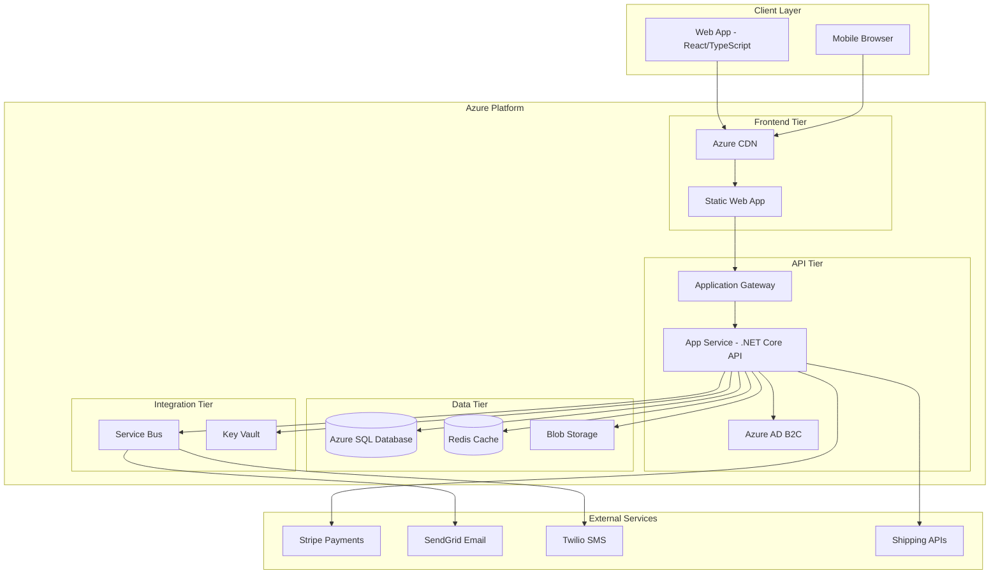
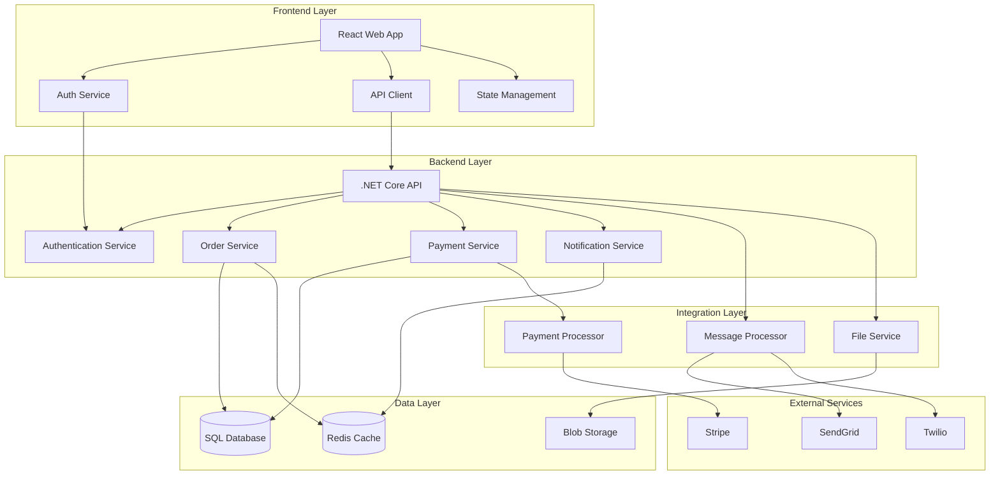
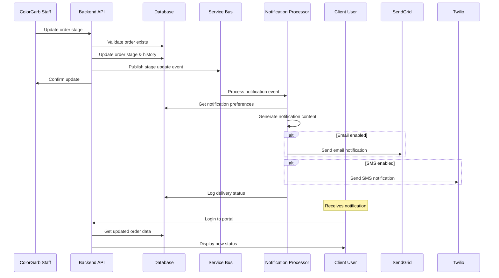
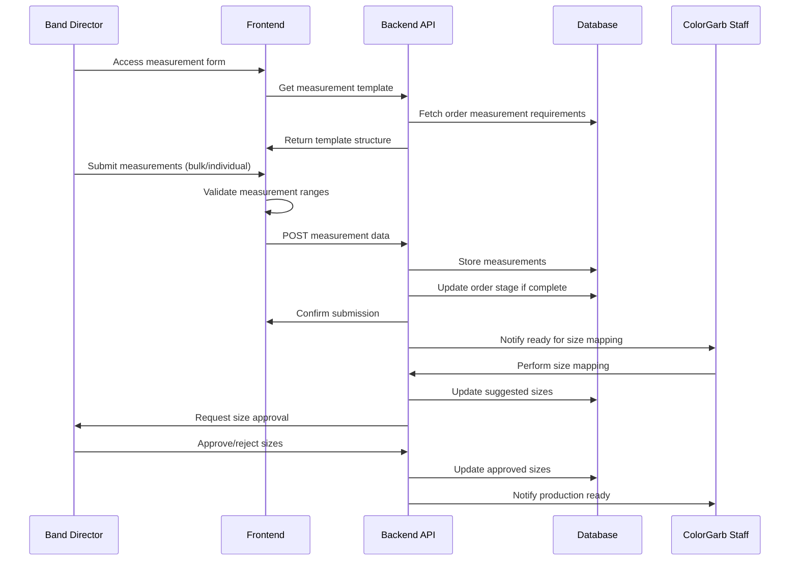
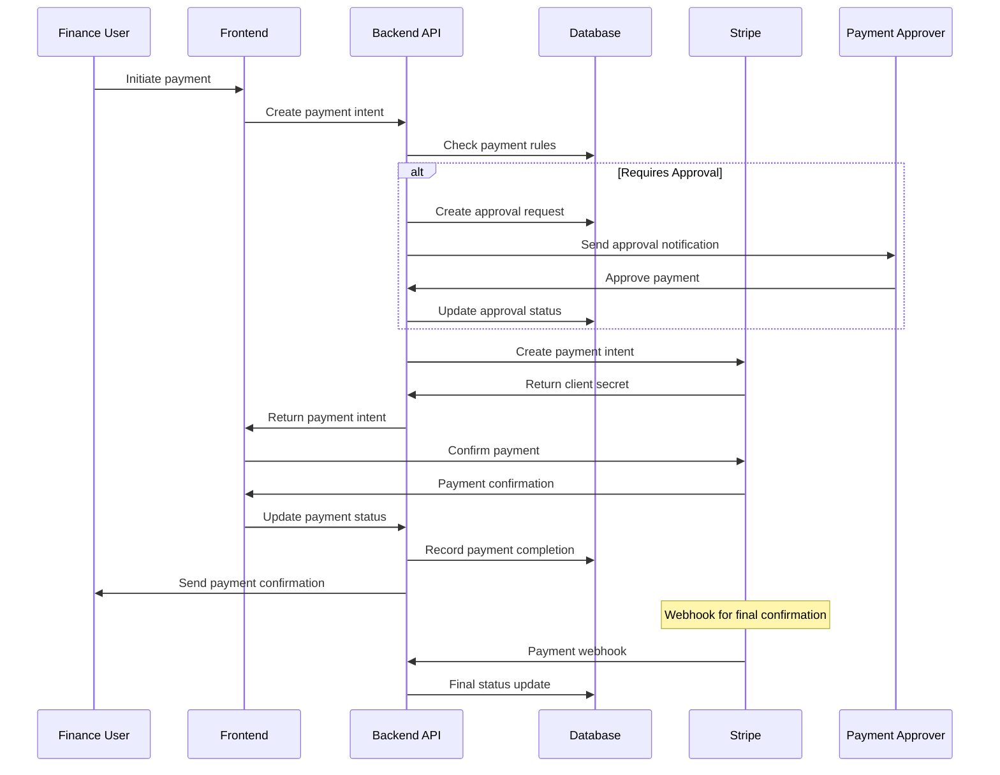
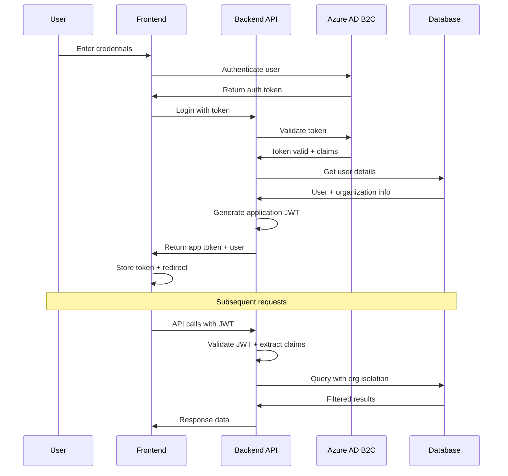
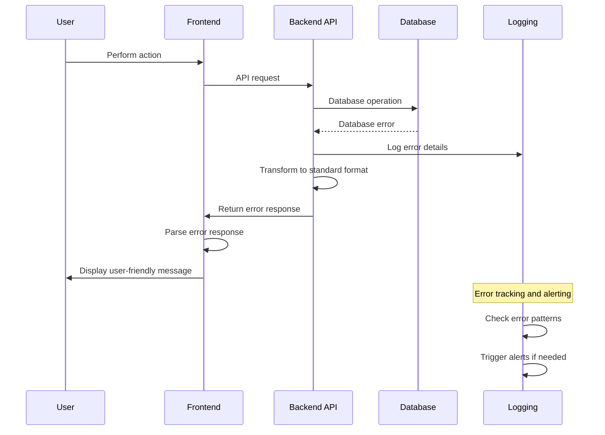

# ColorGarb Client Portal Fullstack Architecture Document

## Introduction

This document outlines the complete fullstack architecture for ColorGarb Client Portal, including backend systems, frontend implementation, and their integration. It serves as the single source of truth for AI-driven development, ensuring consistency across the entire technology stack.

This unified approach combines what would traditionally be separate backend and frontend architecture documents, streamlining the development process for modern fullstack applications where these concerns are increasingly intertwined.

### Starter Template or Existing Project

**N/A - Greenfield project**

After reviewing the PRD and frontend specification, this is a greenfield project with specific technology preferences outlined in the PRD (React/TypeScript frontend, .NET Core backend, monorepo structure). No pre-existing starter templates or codebases constrain our architectural decisions, allowing optimization for the unique costume industry workflows.

### Change Log

| Date | Version | Description | Author |
|------|---------|-------------|---------|
| 2025-08-22 | v1.0 | Initial fullstack architecture creation | Winston (Architect) |

## High Level Architecture

### Technical Summary

The ColorGarb Client Portal employs a modern fullstack architecture using React/TypeScript frontend with .NET Core Web API backend, deployed on Azure using a microservices-ready monolithic structure. The system integrates Azure SQL Database for transactional data, Redis for caching and real-time features, and Azure Service Bus for reliable notification delivery. Key integration points include Stripe for payments, SendGrid for email notifications, and Twilio for SMS, all orchestrated through a secure API gateway pattern that enforces role-based access control and organization-based data isolation. This architecture achieves the PRD goals of 75% communication overhead reduction and 50% client base expansion through automated workflows, transparent order tracking, and mobile-optimized user experiences.

### Platform and Infrastructure Choice

**Platform:** Microsoft Azure  
**Key Services:** App Service (Frontend/Backend), Azure SQL Database, Redis Cache, Service Bus, Blob Storage, Application Gateway, Key Vault  
**Deployment Host and Regions:** Azure App Service in East US (primary) and West US (backup) for high availability

**Rationale:** Azure chosen for strong .NET Core integration, comprehensive PaaS offerings, enterprise-grade security features required for FERPA/PCI compliance, and cost-effective scaling options suitable for the 500+ concurrent user requirement.

### Repository Structure

**Structure:** Monorepo with clear separation of concerns  
**Monorepo Tool:** .NET Solution structure with npm workspaces for frontend packages  
**Package Organization:** Apps (web frontend, API backend), Packages (shared types, common utilities), Infrastructure (ARM templates, deployment scripts)

### High Level Architecture Diagram



### Architectural Patterns

- **Jamstack Architecture:** Static frontend with serverless-style API integration - _Rationale:_ Optimal performance and scalability for content-heavy client portal with mobile-first requirements
- **API Gateway Pattern:** Single entry point through Azure Application Gateway - _Rationale:_ Centralized authentication, rate limiting, and SSL termination for enterprise security
- **Repository Pattern:** Abstract data access logic in .NET Core - _Rationale:_ Enables comprehensive testing and future database migration flexibility
- **CQRS Light:** Separate read/write models for complex queries - _Rationale:_ Optimizes performance for dashboard queries while maintaining simple command operations
- **Event-Driven Notifications:** Service Bus for reliable message delivery - _Rationale:_ Ensures critical notifications (ship date changes, payment confirmations) are delivered even during system maintenance
- **Role-Based Security:** Claims-based authorization with organization isolation - _Rationale:_ Enforces strict data separation between client organizations while enabling ColorGarb staff administrative access

## Tech Stack

### Technology Stack Table

| Category | Technology | Version | Purpose | Rationale |
|----------|------------|---------|---------|-----------|
| Frontend Language | TypeScript | 5.0+ | Type-safe frontend development | Eliminates runtime type errors and improves maintainability for complex order workflows |
| Frontend Framework | React | 18.0+ | Component-based UI development | Mature ecosystem, excellent mobile performance, strong TypeScript integration |
| UI Component Library | Material-UI (MUI) | 5.0+ | Consistent, accessible component library | WCAG AA compliance built-in, mobile-responsive components, customizable theming |
| State Management | Zustand | 4.0+ | Lightweight state management | Simpler than Redux for this use case, excellent TypeScript support, minimal boilerplate |
| Backend Language | C# | 11.0+ | Enterprise-grade API development | Strong typing, excellent async support for I/O operations, mature ecosystem |
| Backend Framework | .NET Core | 7.0+ | Cross-platform web API framework | High performance, built-in dependency injection, excellent Azure integration |
| API Style | REST | - | HTTP-based API communication | Simple, well-understood, excellent tooling support, fits request/response patterns |
| Database | Azure SQL Database | - | Relational data storage | ACID compliance for financial data, excellent .NET integration, automated backup/scaling |
| Cache | Redis | 7.0+ | Session storage and caching | High performance, supports complex data structures for timeline caching |
| File Storage | Azure Blob Storage | - | Document and image storage | Cost-effective, integrated with Azure, CDN support for static assets |
| Authentication | Azure AD B2C | - | Enterprise identity management | SAML/OAuth support for school systems, multi-factor auth, compliance features |
| Frontend Testing | Jest + React Testing Library | Latest | Component and integration testing | Industry standard, excellent async testing support, accessibility testing |
| Backend Testing | xUnit + Moq | Latest | Unit and integration testing | .NET standard, excellent mocking capabilities, parallel test execution |
| E2E Testing | Playwright | Latest | End-to-end user flow testing | Cross-browser support, mobile testing, excellent async handling |
| Build Tool | Vite | 4.0+ | Fast frontend build tooling | Fastest HMR, excellent TypeScript support, optimized production builds |
| Bundler | Built-in Vite | - | Module bundling and optimization | Integrated with Vite, tree-shaking, code splitting |
| IaC Tool | Azure ARM Templates | - | Infrastructure as code | Native Azure integration, version control for infrastructure |
| CI/CD | Azure DevOps | - | Continuous integration/deployment | Integrated with Azure, excellent .NET support, automated testing pipelines |
| Monitoring | Application Insights | - | Application performance monitoring | Real-time performance metrics, error tracking, user analytics |
| Logging | Serilog | Latest | Structured logging framework | JSON logging, multiple sinks, excellent .NET Core integration |
| CSS Framework | Tailwind CSS | 3.0+ | Utility-first CSS framework | Rapid development, mobile-first, excellent tree-shaking |

## Data Models

### Core Business Entities

#### User

**Purpose:** Represents all system users including band directors, finance users, and ColorGarb staff with role-based access control

**Key Attributes:**
- Id: Guid - Unique identifier
- Email: string - Login credential and communication
- OrganizationId: Guid - Links to client organization (null for ColorGarb staff)
- Role: UserRole enum - Director, Finance, ColorGarbStaff
- FirstName: string - Personal identification
- LastName: string - Personal identification
- PhoneNumber: string - SMS notification delivery
- IsActive: bool - Account status
- CreatedAt: DateTime - Audit trail

##### TypeScript Interface
```typescript
interface User {
  id: string;
  email: string;
  organizationId: string | null;
  role: 'Director' | 'Finance' | 'ColorGarbStaff';
  firstName: string;
  lastName: string;
  phoneNumber?: string;
  isActive: boolean;
  createdAt: Date;
  updatedAt: Date;
}
```

##### Relationships
- Belongs to one Organization (except ColorGarb staff)
- Has many NotificationPreferences
- Creates many Messages
- Participates in many Orders (through Organization)

#### Organization

**Purpose:** Represents client schools/booster organizations with complete data isolation for security and privacy

**Key Attributes:**
- Id: Guid - Unique identifier
- Name: string - School or organization name
- Type: OrganizationType enum - School, BoosterClub, Other
- Address: Address object - Shipping and billing
- ContactEmail: string - Primary communication
- ContactPhone: string - Emergency contact
- TaxId: string - Financial compliance
- PaymentTerms: string - Billing configuration
- IsActive: bool - Account status

##### TypeScript Interface
```typescript
interface Organization {
  id: string;
  name: string;
  type: 'School' | 'BoosterClub' | 'Other';
  address: Address;
  contactEmail: string;
  contactPhone: string;
  taxId?: string;
  paymentTerms: string;
  isActive: boolean;
  createdAt: Date;
}

interface Address {
  street1: string;
  street2?: string;
  city: string;
  state: string;
  zipCode: string;
  country: string;
}
```

##### Relationships
- Has many Users (directors, finance users)
- Has many Orders
- Has many PaymentMethods

#### Order

**Purpose:** Central entity representing a costume order through the complete 13-stage manufacturing process

**Key Attributes:**
- Id: Guid - Unique identifier
- OrderNumber: string - Human-readable identifier
- OrganizationId: Guid - Client organization
- Description: string - Order summary
- CurrentStage: OrderStage enum - One of 13 manufacturing stages
- OriginalShipDate: DateTime - Initial promised delivery
- CurrentShipDate: DateTime - Latest revised delivery
- TotalAmount: decimal - Financial total
- Status: OrderStatus enum - Active, Completed, Cancelled
- CreatedAt: DateTime - Order initiation

##### TypeScript Interface
```typescript
interface Order {
  id: string;
  orderNumber: string;
  organizationId: string;
  description: string;
  currentStage: OrderStage;
  originalShipDate: Date;
  currentShipDate: Date;
  totalAmount: number;
  status: 'Active' | 'Completed' | 'Cancelled';
  createdAt: Date;
  updatedAt: Date;
}

type OrderStage = 
  | 'DesignProposal' 
  | 'ProofApproval' 
  | 'Measurements' 
  | 'ProductionPlanning'
  | 'Cutting' 
  | 'Sewing' 
  | 'QualityControl' 
  | 'Finishing'
  | 'FinalInspection' 
  | 'Packaging' 
  | 'ShippingPreparation' 
  | 'ShipOrder'
  | 'Delivery';
```

##### Relationships
- Belongs to one Organization
- Has many OrderStageHistories (timeline tracking)
- Has many Measurements
- Has many Payments
- Has many Messages
- Has many Documents (proofs, contracts)

#### Measurement

**Purpose:** Stores performer measurement data with validation and size mapping approval workflows

**Key Attributes:**
- Id: Guid - Unique identifier
- OrderId: Guid - Associated order
- PerformerName: string - Individual identification
- Measurements: JSON object - Flexible measurement storage
- SuggestedSize: string - ColorGarb size mapping
- ApprovedSize: string - Client-approved final size
- Status: MeasurementStatus enum - Submitted, Mapped, Approved
- SubmittedAt: DateTime - Collection timestamp

##### TypeScript Interface
```typescript
interface Measurement {
  id: string;
  orderId: string;
  performerName: string;
  measurements: Record<string, number>; // chest: 36, waist: 32, etc.
  suggestedSize?: string;
  approvedSize?: string;
  status: 'Submitted' | 'Mapped' | 'Approved' | 'Rejected';
  submittedAt: Date;
  approvedAt?: Date;
}
```

##### Relationships
- Belongs to one Order
- Has many MeasurementHistories (size change tracking)

#### Payment

**Purpose:** Tracks all financial transactions with PO integration and approval workflows

**Key Attributes:**
- Id: Guid - Unique identifier
- OrderId: Guid - Associated order
- Amount: decimal - Payment amount
- Method: PaymentMethod enum - CreditCard, ACH, Check
- Status: PaymentStatus enum - Pending, Approved, Completed, Failed
- PurchaseOrderNumber: string - PO tracking
- TransactionId: string - External payment reference
- ProcessedAt: DateTime - Payment completion

##### TypeScript Interface
```typescript
interface Payment {
  id: string;
  orderId: string;
  amount: number;
  method: 'CreditCard' | 'ACH' | 'Check' | 'PurchaseOrder';
  status: 'Pending' | 'Approved' | 'Completed' | 'Failed' | 'Refunded';
  purchaseOrderNumber?: string;
  transactionId?: string;
  processedAt?: Date;
  createdAt: Date;
}
```

##### Relationships
- Belongs to one Order
- Has many PaymentApprovals (workflow tracking)

## API Specification

### REST API Specification

```yaml
openapi: 3.0.0
info:
  title: ColorGarb Client Portal API
  version: 1.0.0
  description: RESTful API for costume order management and client communication
servers:
  - url: https://api.colorgarb.com/v1
    description: Production API server
  - url: https://staging-api.colorgarb.com/v1
    description: Staging environment

security:
  - BearerAuth: []

paths:
  /auth/login:
    post:
      summary: User authentication
      tags: [Authentication]
      security: []
      requestBody:
        required: true
        content:
          application/json:
            schema:
              type: object
              required: [email, password]
              properties:
                email:
                  type: string
                  format: email
                password:
                  type: string
      responses:
        '200':
          description: Authentication successful
          content:
            application/json:
              schema:
                type: object
                properties:
                  token:
                    type: string
                  expiresIn:
                    type: integer
                  user:
                    $ref: '#/components/schemas/User'

  /orders:
    get:
      summary: Get orders for user's organization
      tags: [Orders]
      parameters:
        - name: status
          in: query
          schema:
            type: string
            enum: [Active, Completed, Cancelled]
        - name: stage
          in: query
          schema:
            $ref: '#/components/schemas/OrderStage'
      responses:
        '200':
          description: List of orders
          content:
            application/json:
              schema:
                type: array
                items:
                  $ref: '#/components/schemas/Order'

  /orders/{orderId}:
    get:
      summary: Get order details
      tags: [Orders]
      parameters:
        - name: orderId
          in: path
          required: true
          schema:
            type: string
            format: uuid
      responses:
        '200':
          description: Order details
          content:
            application/json:
              schema:
                $ref: '#/components/schemas/OrderDetail'

    patch:
      summary: Update order stage (ColorGarb staff only)
      tags: [Orders]
      parameters:
        - name: orderId
          in: path
          required: true
          schema:
            type: string
            format: uuid
      requestBody:
        required: true
        content:
          application/json:
            schema:
              type: object
              properties:
                stage:
                  $ref: '#/components/schemas/OrderStage'
                shipDate:
                  type: string
                  format: date
                reason:
                  type: string
      responses:
        '200':
          description: Order updated successfully

  /orders/{orderId}/measurements:
    get:
      summary: Get measurements for order
      tags: [Measurements]
      parameters:
        - name: orderId
          in: path
          required: true
          schema:
            type: string
            format: uuid
      responses:
        '200':
          description: List of measurements
          content:
            application/json:
              schema:
                type: array
                items:
                  $ref: '#/components/schemas/Measurement'

    post:
      summary: Submit measurements
      tags: [Measurements]
      parameters:
        - name: orderId
          in: path
          required: true
          schema:
            type: string
            format: uuid
      requestBody:
        required: true
        content:
          application/json:
            schema:
              type: array
              items:
                $ref: '#/components/schemas/MeasurementSubmission'
      responses:
        '201':
          description: Measurements submitted successfully

  /orders/{orderId}/payments:
    get:
      summary: Get payment history
      tags: [Payments]
      parameters:
        - name: orderId
          in: path
          required: true
          schema:
            type: string
            format: uuid
      responses:
        '200':
          description: Payment history
          content:
            application/json:
              schema:
                type: array
                items:
                  $ref: '#/components/schemas/Payment'

    post:
      summary: Process payment
      tags: [Payments]
      parameters:
        - name: orderId
          in: path
          required: true
          schema:
            type: string
            format: uuid
      requestBody:
        required: true
        content:
          application/json:
            schema:
              $ref: '#/components/schemas/PaymentRequest'
      responses:
        '201':
          description: Payment processed successfully

  /orders/{orderId}/messages:
    get:
      summary: Get order messages
      tags: [Messages]
      parameters:
        - name: orderId
          in: path
          required: true
          schema:
            type: string
            format: uuid
      responses:
        '200':
          description: Message thread
          content:
            application/json:
              schema:
                type: array
                items:
                  $ref: '#/components/schemas/Message'

    post:
      summary: Send message
      tags: [Messages]
      parameters:
        - name: orderId
          in: path
          required: true
          schema:
            type: string
            format: uuid
      requestBody:
        required: true
        content:
          multipart/form-data:
            schema:
              type: object
              required: [content]
              properties:
                content:
                  type: string
                attachments:
                  type: array
                  items:
                    type: string
                    format: binary
      responses:
        '201':
          description: Message sent successfully

components:
  securitySchemes:
    BearerAuth:
      type: http
      scheme: bearer
      bearerFormat: JWT

  schemas:
    User:
      type: object
      properties:
        id:
          type: string
          format: uuid
        email:
          type: string
          format: email
        firstName:
          type: string
        lastName:
          type: string
        role:
          type: string
          enum: [Director, Finance, ColorGarbStaff]
        organizationId:
          type: string
          format: uuid

    Order:
      type: object
      properties:
        id:
          type: string
          format: uuid
        orderNumber:
          type: string
        description:
          type: string
        currentStage:
          $ref: '#/components/schemas/OrderStage'
        originalShipDate:
          type: string
          format: date
        currentShipDate:
          type: string
          format: date
        totalAmount:
          type: number
          format: decimal
        status:
          type: string
          enum: [Active, Completed, Cancelled]

    OrderStage:
      type: string
      enum:
        - DesignProposal
        - ProofApproval
        - Measurements
        - ProductionPlanning
        - Cutting
        - Sewing
        - QualityControl
        - Finishing
        - FinalInspection
        - Packaging
        - ShippingPreparation
        - ShipOrder
        - Delivery

    OrderDetail:
      allOf:
        - $ref: '#/components/schemas/Order'
        - type: object
          properties:
            organization:
              $ref: '#/components/schemas/Organization'
            stageHistory:
              type: array
              items:
                $ref: '#/components/schemas/StageHistory'
            nextActions:
              type: array
              items:
                type: string

    Organization:
      type: object
      properties:
        id:
          type: string
          format: uuid
        name:
          type: string
        type:
          type: string
          enum: [School, BoosterClub, Other]
        contactEmail:
          type: string
          format: email

    Measurement:
      type: object
      properties:
        id:
          type: string
          format: uuid
        performerName:
          type: string
        measurements:
          type: object
          additionalProperties:
            type: number
        suggestedSize:
          type: string
        status:
          type: string
          enum: [Submitted, Mapped, Approved, Rejected]

    MeasurementSubmission:
      type: object
      required: [performerName, measurements]
      properties:
        performerName:
          type: string
        measurements:
          type: object
          additionalProperties:
            type: number

    Payment:
      type: object
      properties:
        id:
          type: string
          format: uuid
        amount:
          type: number
          format: decimal
        method:
          type: string
          enum: [CreditCard, ACH, Check, PurchaseOrder]
        status:
          type: string
          enum: [Pending, Approved, Completed, Failed, Refunded]
        processedAt:
          type: string
          format: date-time

    PaymentRequest:
      type: object
      required: [amount, method]
      properties:
        amount:
          type: number
          format: decimal
        method:
          type: string
          enum: [CreditCard, ACH, PurchaseOrder]
        purchaseOrderNumber:
          type: string
        paymentDetails:
          type: object

    Message:
      type: object
      properties:
        id:
          type: string
          format: uuid
        content:
          type: string
        senderName:
          type: string
        senderRole:
          type: string
        sentAt:
          type: string
          format: date-time
        attachments:
          type: array
          items:
            type: object
            properties:
              filename:
                type: string
              url:
                type: string

    StageHistory:
      type: object
      properties:
        stage:
          $ref: '#/components/schemas/OrderStage'
        enteredAt:
          type: string
          format: date-time
        updatedBy:
          type: string
        notes:
          type: string
```

## Components

### Frontend Application (React)

**Responsibility:** Provides mobile-first user interface for order management, communication, and approval workflows with role-based views and real-time updates

**Key Interfaces:**
- REST API client for backend communication
- Azure AD B2C integration for authentication
- WebSocket connection for real-time notifications
- File upload interface for measurements and documents

**Dependencies:** Backend API, Azure AD B2C, CDN for static assets

**Technology Stack:** React 18, TypeScript, Material-UI, Zustand state management, Vite build system, deployed as Azure Static Web App

### Backend API (.NET Core)

**Responsibility:** Handles business logic, data persistence, authentication/authorization, and external service integration with comprehensive audit trails and role-based security

**Key Interfaces:**
- RESTful HTTP API endpoints
- Azure SQL Database integration
- Service Bus message publishing
- External payment and notification APIs

**Dependencies:** Azure SQL Database, Redis cache, Service Bus, external APIs (Stripe, SendGrid, Twilio)

**Technology Stack:** .NET Core 7, Entity Framework Core, Azure Service Bus SDK, Serilog logging, deployed as Azure App Service

### Message Processing Service

**Responsibility:** Processes notification events from Service Bus to deliver email/SMS notifications with retry logic and delivery tracking

**Key Interfaces:**
- Service Bus message consumption
- SendGrid Email API integration
- Twilio SMS API integration
- Notification delivery status tracking

**Dependencies:** Service Bus, SendGrid, Twilio, Redis for delivery tracking

**Technology Stack:** .NET Core background service, Azure Service Bus, SendGrid/Twilio SDKs

### File Storage Service

**Responsibility:** Manages secure document storage for measurements, proofs, and order documents with access control and CDN integration

**Key Interfaces:**
- Azure Blob Storage integration
- Secure file upload/download APIs
- CDN integration for performance
- File access authorization

**Dependencies:** Azure Blob Storage, Azure CDN, Backend API for authorization

**Technology Stack:** Azure Blob Storage with CDN, integrated with main API service

### External Integration Layer

**Responsibility:** Manages connections to payment processors, shipping APIs, and notification services with error handling and retry logic

**Key Interfaces:**
- Stripe payment processing API
- Shipping carrier APIs for tracking
- Email/SMS service provider APIs
- Webhook endpoints for external notifications

**Dependencies:** External service providers, Backend API for data persistence

**Technology Stack:** HTTP clients with Polly retry policies, webhook handlers, secure credential management

### Component Diagrams



## External APIs

### Stripe Payment Processing API

- **Purpose:** Secure payment processing for credit cards and ACH transfers with PCI compliance
- **Documentation:** https://stripe.com/docs/api
- **Base URL(s):** https://api.stripe.com/v1
- **Authentication:** API key-based authentication with webhook signatures
- **Rate Limits:** 100 requests per second for most endpoints

**Key Endpoints Used:**
- `POST /payment_intents` - Create payment intent for order payments
- `POST /customers` - Create customer records for organizations
- `GET /payment_intents/{id}` - Retrieve payment status
- `POST /webhook_endpoints` - Configure payment status webhooks

**Integration Notes:** All payments require Strong Customer Authentication (SCA) compliance. Webhook endpoints handle asynchronous payment confirmations with signature verification for security.

### SendGrid Email API

- **Purpose:** Transactional email delivery for notifications, order updates, and communication
- **Documentation:** https://docs.sendgrid.com/api-reference
- **Base URL(s):** https://api.sendgrid.com/v3
- **Authentication:** API key authentication with domain verification
- **Rate Limits:** Based on plan tier, typically 600 emails per minute

**Key Endpoints Used:**
- `POST /mail/send` - Send transactional emails
- `GET /stats` - Email delivery statistics
- `POST /templates` - Manage email templates
- `POST /webhook/event` - Configure delivery event webhooks

**Integration Notes:** All emails use pre-approved templates for compliance. Delivery tracking and bounce handling implemented through webhook integration.

### Twilio SMS API

- **Purpose:** SMS notifications for urgent updates and mobile-first communication
- **Documentation:** https://www.twilio.com/docs/sms/api
- **Base URL(s):** https://api.twilio.com/2010-04-01
- **Authentication:** Account SID and Auth Token with request signing
- **Rate Limits:** 1 message per second per phone number by default

**Key Endpoints Used:**
- `POST /Accounts/{AccountSid}/Messages.json` - Send SMS messages
- `GET /Accounts/{AccountSid}/Messages/{MessageSid}.json` - Get message status
- `POST /Accounts/{AccountSid}/IncomingPhoneNumbers.json` - Configure webhooks

**Integration Notes:** Opt-in verification required for all SMS recipients. Delivery status tracking through webhook callbacks. Rate limiting implemented to prevent spam.

## Core Workflows

### Order Status Update Workflow



### Measurement Submission Workflow



### Payment Processing Workflow



## Database Schema

```sql
-- Organizations table
CREATE TABLE Organizations (
    Id UNIQUEIDENTIFIER PRIMARY KEY DEFAULT NEWID(),
    Name NVARCHAR(255) NOT NULL,
    Type NVARCHAR(50) NOT NULL CHECK (Type IN ('School', 'BoosterClub', 'Other')),
    ContactEmail NVARCHAR(255) NOT NULL,
    ContactPhone NVARCHAR(50),
    Address NVARCHAR(MAX), -- JSON object
    TaxId NVARCHAR(50),
    PaymentTerms NVARCHAR(100),
    IsActive BIT NOT NULL DEFAULT 1,
    CreatedAt DATETIME2 NOT NULL DEFAULT GETUTCDATE(),
    UpdatedAt DATETIME2 NOT NULL DEFAULT GETUTCDATE()
);

-- Users table
CREATE TABLE Users (
    Id UNIQUEIDENTIFIER PRIMARY KEY DEFAULT NEWID(),
    Email NVARCHAR(255) NOT NULL UNIQUE,
    PasswordHash NVARCHAR(255) NOT NULL,
    FirstName NVARCHAR(100) NOT NULL,
    LastName NVARCHAR(100) NOT NULL,
    PhoneNumber NVARCHAR(50),
    Role NVARCHAR(50) NOT NULL CHECK (Role IN ('Director', 'Finance', 'ColorGarbStaff')),
    OrganizationId UNIQUEIDENTIFIER,
    IsActive BIT NOT NULL DEFAULT 1,
    LastLoginAt DATETIME2,
    CreatedAt DATETIME2 NOT NULL DEFAULT GETUTCDATE(),
    UpdatedAt DATETIME2 NOT NULL DEFAULT GETUTCDATE(),
    
    FOREIGN KEY (OrganizationId) REFERENCES Organizations(Id)
);

-- Orders table
CREATE TABLE Orders (
    Id UNIQUEIDENTIFIER PRIMARY KEY DEFAULT NEWID(),
    OrderNumber NVARCHAR(50) NOT NULL UNIQUE,
    OrganizationId UNIQUEIDENTIFIER NOT NULL,
    Description NVARCHAR(500) NOT NULL,
    CurrentStage NVARCHAR(50) NOT NULL DEFAULT 'DesignProposal',
    OriginalShipDate DATETIME2 NOT NULL,
    CurrentShipDate DATETIME2 NOT NULL,
    TotalAmount DECIMAL(10,2) NOT NULL,
    Status NVARCHAR(50) NOT NULL DEFAULT 'Active' CHECK (Status IN ('Active', 'Completed', 'Cancelled')),
    CreatedAt DATETIME2 NOT NULL DEFAULT GETUTCDATE(),
    UpdatedAt DATETIME2 NOT NULL DEFAULT GETUTCDATE(),
    
    FOREIGN KEY (OrganizationId) REFERENCES Organizations(Id),
    INDEX IX_Orders_Organization (OrganizationId),
    INDEX IX_Orders_Status_Stage (Status, CurrentStage)
);

-- Order stage history for timeline tracking
CREATE TABLE OrderStageHistory (
    Id UNIQUEIDENTIFIER PRIMARY KEY DEFAULT NEWID(),
    OrderId UNIQUEIDENTIFIER NOT NULL,
    Stage NVARCHAR(50) NOT NULL,
    EnteredAt DATETIME2 NOT NULL DEFAULT GETUTCDATE(),
    UpdatedBy UNIQUEIDENTIFIER NOT NULL,
    Notes NVARCHAR(1000),
    PreviousShipDate DATETIME2,
    NewShipDate DATETIME2,
    ChangeReason NVARCHAR(255),
    
    FOREIGN KEY (OrderId) REFERENCES Orders(Id) ON DELETE CASCADE,
    FOREIGN KEY (UpdatedBy) REFERENCES Users(Id),
    INDEX IX_OrderStageHistory_Order (OrderId)
);

-- Measurements table
CREATE TABLE Measurements (
    Id UNIQUEIDENTIFIER PRIMARY KEY DEFAULT NEWID(),
    OrderId UNIQUEIDENTIFIER NOT NULL,
    PerformerName NVARCHAR(255) NOT NULL,
    MeasurementData NVARCHAR(MAX) NOT NULL, -- JSON object
    SuggestedSize NVARCHAR(50),
    ApprovedSize NVARCHAR(50),
    Status NVARCHAR(50) NOT NULL DEFAULT 'Submitted' CHECK (Status IN ('Submitted', 'Mapped', 'Approved', 'Rejected')),
    SubmittedAt DATETIME2 NOT NULL DEFAULT GETUTCDATE(),
    ApprovedAt DATETIME2,
    ApprovedBy UNIQUEIDENTIFIER,
    
    FOREIGN KEY (OrderId) REFERENCES Orders(Id) ON DELETE CASCADE,
    FOREIGN KEY (ApprovedBy) REFERENCES Users(Id),
    INDEX IX_Measurements_Order (OrderId),
    INDEX IX_Measurements_Status (Status)
);

-- Payments table
CREATE TABLE Payments (
    Id UNIQUEIDENTIFIER PRIMARY KEY DEFAULT NEWID(),
    OrderId UNIQUEIDENTIFIER NOT NULL,
    Amount DECIMAL(10,2) NOT NULL,
    Method NVARCHAR(50) NOT NULL CHECK (Method IN ('CreditCard', 'ACH', 'Check', 'PurchaseOrder')),
    Status NVARCHAR(50) NOT NULL DEFAULT 'Pending' CHECK (Status IN ('Pending', 'Approved', 'Completed', 'Failed', 'Refunded')),
    PurchaseOrderNumber NVARCHAR(100),
    StripePaymentIntentId NVARCHAR(255),
    TransactionId NVARCHAR(255),
    ProcessedAt DATETIME2,
    CreatedAt DATETIME2 NOT NULL DEFAULT GETUTCDATE(),
    
    FOREIGN KEY (OrderId) REFERENCES Orders(Id) ON DELETE CASCADE,
    INDEX IX_Payments_Order (OrderId),
    INDEX IX_Payments_Status (Status)
);

-- Payment approvals for workflow tracking
CREATE TABLE PaymentApprovals (
    Id UNIQUEIDENTIFIER PRIMARY KEY DEFAULT NEWID(),
    PaymentId UNIQUEIDENTIFIER NOT NULL,
    ApproverId UNIQUEIDENTIFIER NOT NULL,
    Status NVARCHAR(50) NOT NULL CHECK (Status IN ('Pending', 'Approved', 'Rejected')),
    Notes NVARCHAR(500),
    ApprovedAt DATETIME2,
    
    FOREIGN KEY (PaymentId) REFERENCES Payments(Id) ON DELETE CASCADE,
    FOREIGN KEY (ApproverId) REFERENCES Users(Id),
    INDEX IX_PaymentApprovals_Payment (PaymentId)
);

-- Messages table for order communication
CREATE TABLE Messages (
    Id UNIQUEIDENTIFIER PRIMARY KEY DEFAULT NEWID(),
    OrderId UNIQUEIDENTIFIER NOT NULL,
    SenderId UNIQUEIDENTIFIER NOT NULL,
    Content NVARCHAR(MAX) NOT NULL,
    Attachments NVARCHAR(MAX), -- JSON array of file references
    SentAt DATETIME2 NOT NULL DEFAULT GETUTCDATE(),
    ReadAt DATETIME2,
    
    FOREIGN KEY (OrderId) REFERENCES Orders(Id) ON DELETE CASCADE,
    FOREIGN KEY (SenderId) REFERENCES Users(Id),
    INDEX IX_Messages_Order_Date (OrderId, SentAt DESC)
);

-- Notification preferences
CREATE TABLE NotificationPreferences (
    Id UNIQUEIDENTIFIER PRIMARY KEY DEFAULT NEWID(),
    UserId UNIQUEIDENTIFIER NOT NULL,
    EmailEnabled BIT NOT NULL DEFAULT 1,
    SmsEnabled BIT NOT NULL DEFAULT 0,
    NotificationTypes NVARCHAR(MAX) NOT NULL, -- JSON array
    CreatedAt DATETIME2 NOT NULL DEFAULT GETUTCDATE(),
    UpdatedAt DATETIME2 NOT NULL DEFAULT GETUTCDATE(),
    
    FOREIGN KEY (UserId) REFERENCES Users(Id) ON DELETE CASCADE,
    INDEX IX_NotificationPreferences_User (UserId)
);

-- Documents table for proofs, contracts, etc.
CREATE TABLE Documents (
    Id UNIQUEIDENTIFIER PRIMARY KEY DEFAULT NEWID(),
    OrderId UNIQUEIDENTIFIER NOT NULL,
    FileName NVARCHAR(255) NOT NULL,
    FileType NVARCHAR(50) NOT NULL,
    BlobStorageUrl NVARCHAR(500) NOT NULL,
    DocumentType NVARCHAR(50) NOT NULL CHECK (DocumentType IN ('Proof', 'Contract', 'Measurement', 'Invoice', 'Other')),
    Version INT NOT NULL DEFAULT 1,
    UploadedBy UNIQUEIDENTIFIER NOT NULL,
    UploadedAt DATETIME2 NOT NULL DEFAULT GETUTCDATE(),
    IsActive BIT NOT NULL DEFAULT 1,
    
    FOREIGN KEY (OrderId) REFERENCES Orders(Id) ON DELETE CASCADE,
    FOREIGN KEY (UploadedBy) REFERENCES Users(Id),
    INDEX IX_Documents_Order_Type (OrderId, DocumentType)
);

-- Create indexes for performance
CREATE INDEX IX_Users_Organization ON Users(OrganizationId) WHERE OrganizationId IS NOT NULL;
CREATE INDEX IX_Users_Email ON Users(Email);
CREATE INDEX IX_Orders_CurrentStage ON Orders(CurrentStage);
CREATE INDEX IX_Orders_ShipDate ON Orders(CurrentShipDate);

-- Row-level security for organization isolation
ALTER TABLE Orders ENABLE ROW LEVEL SECURITY;
ALTER TABLE Measurements ENABLE ROW LEVEL SECURITY;
ALTER TABLE Payments ENABLE ROW LEVEL SECURITY;
ALTER TABLE Messages ENABLE ROW LEVEL SECURITY;

-- Security policies ensure users only see their organization's data
CREATE SECURITY POLICY OrganizationIsolation_Orders ON Orders
    ADD FILTER PREDICATE (
        OrganizationId = CAST(SESSION_CONTEXT(N'OrganizationId') AS UNIQUEIDENTIFIER)
        OR CAST(SESSION_CONTEXT(N'Role') AS NVARCHAR(50)) = 'ColorGarbStaff'
    );
```

## Frontend Architecture

### Component Architecture

#### Component Organization
```
src/
├── components/           # Reusable UI components
│   ├── common/          # Generic components (Button, Input, Modal)
│   ├── forms/           # Form-specific components
│   ├── layout/          # Layout components (Header, Navigation)
│   └── timeline/        # Timeline-specific components
├── pages/               # Page-level components
│   ├── Dashboard/       # Main dashboard
│   ├── OrderDetail/     # Order detail workspace
│   ├── Measurements/    # Measurement collection
│   └── Auth/           # Authentication pages
├── hooks/               # Custom React hooks
├── services/           # API communication layer
├── stores/             # Zustand state management
├── types/              # TypeScript type definitions
└── utils/              # Utility functions
```

#### Component Template
```typescript
import React from 'react';
import { Box, Typography } from '@mui/material';

interface OrderTimelineProps {
  orderId: string;
  currentStage: OrderStage;
  stageHistory: StageHistory[];
  onStageClick?: (stage: OrderStage) => void;
}

export const OrderTimeline: React.FC<OrderTimelineProps> = ({
  orderId,
  currentStage,
  stageHistory,
  onStageClick
}) => {
  const stages = [
    'DesignProposal', 'ProofApproval', 'Measurements', 'ProductionPlanning',
    'Cutting', 'Sewing', 'QualityControl', 'Finishing',
    'FinalInspection', 'Packaging', 'ShippingPreparation', 'ShipOrder', 'Delivery'
  ] as const;

  return (
    <Box sx={{ display: 'flex', flexDirection: 'column', gap: 2 }}>
      <Typography variant="h6">Order Progress</Typography>
      {stages.map((stage, index) => (
        <TimelineStage
          key={stage}
          stage={stage}
          isCurrent={stage === currentStage}
          isCompleted={stages.indexOf(currentStage) > index}
          history={stageHistory.find(h => h.stage === stage)}
          onClick={() => onStageClick?.(stage)}
        />
      ))}
    </Box>
  );
};

export default OrderTimeline;
```

### State Management Architecture

#### State Structure
```typescript
// Global app state using Zustand
interface AppState {
  // Authentication state
  auth: {
    user: User | null;
    token: string | null;
    isAuthenticated: boolean;
    login: (credentials: LoginCredentials) => Promise<void>;
    logout: () => void;
  };

  // Orders state
  orders: {
    items: Order[];
    selectedOrder: OrderDetail | null;
    loading: boolean;
    error: string | null;
    fetchOrders: () => Promise<void>;
    selectOrder: (orderId: string) => Promise<void>;
    updateOrderStage: (orderId: string, stage: OrderStage) => Promise<void>;
  };

  // Measurements state
  measurements: {
    items: Measurement[];
    loading: boolean;
    submitMeasurements: (orderId: string, measurements: MeasurementSubmission[]) => Promise<void>;
    approveSizes: (measurementIds: string[], sizes: string[]) => Promise<void>;
  };

  // Notifications state
  notifications: {
    items: Notification[];
    unreadCount: number;
    markAsRead: (notificationId: string) => void;
    clearAll: () => void;
  };

  // UI state
  ui: {
    sidebarOpen: boolean;
    currentView: 'dashboard' | 'orders' | 'messages' | 'profile';
    toggleSidebar: () => void;
    setCurrentView: (view: string) => void;
  };
}

// Store implementation
export const useAppStore = create<AppState>((set, get) => ({
  auth: {
    user: null,
    token: localStorage.getItem('auth_token'),
    isAuthenticated: !!localStorage.getItem('auth_token'),
    login: async (credentials) => {
      const response = await authService.login(credentials);
      set(state => ({
        auth: {
          ...state.auth,
          user: response.user,
          token: response.token,
          isAuthenticated: true
        }
      }));
    },
    logout: () => {
      localStorage.removeItem('auth_token');
      set(state => ({
        auth: {
          ...state.auth,
          user: null,
          token: null,
          isAuthenticated: false
        }
      }));
    }
  },
  // ... other state slices
}));
```

#### State Management Patterns
- **Single Store Pattern:** Centralized state management with Zustand for simplicity
- **Slice Pattern:** Logical separation of concerns (auth, orders, measurements, etc.)
- **Async Action Pattern:** Async operations encapsulated in store actions with loading/error states
- **Optimistic Updates:** Immediate UI updates for better perceived performance
- **Local State for UI:** Component-local state for form inputs and temporary UI state

### Routing Architecture

#### Route Organization
```
/                        # Dashboard (default)
/login                   # Authentication
/orders                  # Order list
/orders/:orderId         # Order detail workspace
/orders/:orderId/measurements  # Measurement collection
/orders/:orderId/payments      # Payment processing
/orders/:orderId/messages      # Order communication
/profile                 # User profile and settings
/admin                   # ColorGarb staff admin (role-protected)
/admin/orders            # All client orders
/admin/communications    # Communication center
```

#### Protected Route Pattern
```typescript
import React from 'react';
import { Navigate, useLocation } from 'react-router-dom';
import { useAppStore } from '../stores/app-store';

interface ProtectedRouteProps {
  children: React.ReactNode;
  requiredRole?: 'Director' | 'Finance' | 'ColorGarbStaff';
  requiredPermissions?: string[];
}

export const ProtectedRoute: React.FC<ProtectedRouteProps> = ({
  children,
  requiredRole,
  requiredPermissions = []
}) => {
  const { isAuthenticated, user } = useAppStore(state => state.auth);
  const location = useLocation();

  if (!isAuthenticated) {
    return <Navigate to="/login" state={{ from: location }} replace />;
  }

  if (requiredRole && user?.role !== requiredRole) {
    return <Navigate to="/unauthorized" replace />;
  }

  if (requiredPermissions.length > 0) {
    const hasPermissions = requiredPermissions.every(permission =>
      user?.permissions?.includes(permission)
    );
    
    if (!hasPermissions) {
      return <Navigate to="/unauthorized" replace />;
    }
  }

  return <>{children}</>;
};

// Usage in routing configuration
const AppRoutes = () => (
  <Routes>
    <Route path="/login" element={<LoginPage />} />
    <Route path="/" element={
      <ProtectedRoute>
        <DashboardPage />
      </ProtectedRoute>
    } />
    <Route path="/admin/*" element={
      <ProtectedRoute requiredRole="ColorGarbStaff">
        <AdminRoutes />
      </ProtectedRoute>
    } />
  </Routes>
);
```

### Frontend Services Layer

#### API Client Setup
```typescript
import axios, { AxiosInstance, AxiosRequestConfig, AxiosResponse } from 'axios';
import { useAppStore } from '../stores/app-store';

class ApiClient {
  private client: AxiosInstance;

  constructor(baseURL: string) {
    this.client = axios.create({
      baseURL,
      timeout: 10000,
      headers: {
        'Content-Type': 'application/json',
      },
    });

    // Request interceptor for auth token
    this.client.interceptors.request.use(
      (config) => {
        const token = useAppStore.getState().auth.token;
        if (token) {
          config.headers.Authorization = `Bearer ${token}`;
        }
        return config;
      },
      (error) => Promise.reject(error)
    );

    // Response interceptor for error handling
    this.client.interceptors.response.use(
      (response: AxiosResponse) => response,
      (error) => {
        if (error.response?.status === 401) {
          useAppStore.getState().auth.logout();
          window.location.href = '/login';
        }
        return Promise.reject(error);
      }
    );
  }

  async get<T>(url: string, config?: AxiosRequestConfig): Promise<T> {
    const response = await this.client.get<T>(url, config);
    return response.data;
  }

  async post<T>(url: string, data?: any, config?: AxiosRequestConfig): Promise<T> {
    const response = await this.client.post<T>(url, data, config);
    return response.data;
  }

  async patch<T>(url: string, data?: any, config?: AxiosRequestConfig): Promise<T> {
    const response = await this.client.patch<T>(url, data, config);
    return response.data;
  }

  async delete<T>(url: string, config?: AxiosRequestConfig): Promise<T> {
    const response = await this.client.delete<T>(url, config);
    return response.data;
  }
}

export const apiClient = new ApiClient(process.env.REACT_APP_API_BASE_URL!);
```

#### Service Example
```typescript
import { apiClient } from './api-client';
import { Order, OrderDetail, OrderStage } from '../types/order';

export class OrderService {
  async getOrders(filters?: {
    status?: string;
    stage?: OrderStage;
  }): Promise<Order[]> {
    const params = new URLSearchParams();
    if (filters?.status) params.append('status', filters.status);
    if (filters?.stage) params.append('stage', filters.stage);

    return apiClient.get<Order[]>(`/orders?${params.toString()}`);
  }

  async getOrderDetail(orderId: string): Promise<OrderDetail> {
    return apiClient.get<OrderDetail>(`/orders/${orderId}`);
  }

  async updateOrderStage(
    orderId: string,
    stage: OrderStage,
    shipDate?: Date,
    reason?: string
  ): Promise<void> {
    await apiClient.patch(`/orders/${orderId}`, {
      stage,
      shipDate: shipDate?.toISOString(),
      reason
    });
  }

  async submitMeasurements(
    orderId: string,
    measurements: MeasurementSubmission[]
  ): Promise<void> {
    await apiClient.post(`/orders/${orderId}/measurements`, measurements);
  }

  async uploadMeasurementFile(
    orderId: string,
    file: File
  ): Promise<MeasurementImportResult> {
    const formData = new FormData();
    formData.append('file', file);

    return apiClient.post<MeasurementImportResult>(
      `/orders/${orderId}/measurements/upload`,
      formData,
      {
        headers: {
          'Content-Type': 'multipart/form-data',
        },
      }
    );
  }
}

export const orderService = new OrderService();
```

## Backend Architecture

### Service Architecture

#### Traditional Server Organization
```
src/
├── Controllers/         # API endpoints and request handling
│   ├── AuthController.cs
│   ├── OrdersController.cs
│   ├── MeasurementsController.cs
│   └── PaymentsController.cs
├── Services/           # Business logic layer
│   ├── Interfaces/     # Service contracts
│   ├── OrderService.cs
│   ├── PaymentService.cs
│   └── NotificationService.cs
├── Models/             # Data models and DTOs
│   ├── Entities/       # Database entities
│   ├── DTOs/          # Data transfer objects
│   └── ViewModels/    # Response models
├── Data/              # Data access layer
│   ├── ApplicationDbContext.cs
│   ├── Repositories/   # Repository pattern
│   └── Migrations/    # EF Core migrations
├── Infrastructure/    # External service integrations
│   ├── Payment/       # Stripe integration
│   ├── Notifications/ # Email/SMS services
│   └── Storage/       # Blob storage
└── Common/            # Shared utilities
    ├── Extensions/
    ├── Middleware/
    └── Validators/
```

#### Controller Template
```csharp
[ApiController]
[Route("api/[controller]")]
[Authorize]
public class OrdersController : ControllerBase
{
    private readonly IOrderService _orderService;
    private readonly ILogger<OrdersController> _logger;
    private readonly IMapper _mapper;

    public OrdersController(
        IOrderService orderService,
        ILogger<OrdersController> logger,
        IMapper mapper)
    {
        _orderService = orderService;
        _logger = logger;
        _mapper = mapper;
    }

    [HttpGet]
    public async Task<ActionResult<IEnumerable<OrderDto>>> GetOrders(
        [FromQuery] string? status = null,
        [FromQuery] string? stage = null)
    {
        try
        {
            var organizationId = GetCurrentOrganizationId();
            var orders = await _orderService.GetOrdersAsync(organizationId, status, stage);
            var orderDtos = _mapper.Map<IEnumerable<OrderDto>>(orders);
            
            return Ok(orderDtos);
        }
        catch (Exception ex)
        {
            _logger.LogError(ex, "Error retrieving orders for organization {OrganizationId}", 
                GetCurrentOrganizationId());
            return StatusCode(500, "An error occurred while retrieving orders");
        }
    }

    [HttpGet("{orderId:guid}")]
    public async Task<ActionResult<OrderDetailDto>> GetOrderDetail(Guid orderId)
    {
        try
        {
            var order = await _orderService.GetOrderDetailAsync(orderId);
            
            if (order == null)
            {
                return NotFound($"Order {orderId} not found");
            }

            // Verify organization access
            if (!HasAccessToOrder(order))
            {
                return Forbid("Access denied to this order");
            }

            var orderDetailDto = _mapper.Map<OrderDetailDto>(order);
            return Ok(orderDetailDto);
        }
        catch (Exception ex)
        {
            _logger.LogError(ex, "Error retrieving order detail for {OrderId}", orderId);
            return StatusCode(500, "An error occurred while retrieving order details");
        }
    }

    [HttpPatch("{orderId:guid}")]
    [Authorize(Roles = "ColorGarbStaff")]
    public async Task<IActionResult> UpdateOrderStage(
        Guid orderId, 
        [FromBody] UpdateOrderStageRequest request)
    {
        try
        {
            var userId = GetCurrentUserId();
            await _orderService.UpdateOrderStageAsync(
                orderId, 
                request.Stage, 
                request.ShipDate, 
                request.Reason, 
                userId);

            return NoContent();
        }
        catch (OrderNotFoundException)
        {
            return NotFound($"Order {orderId} not found");
        }
        catch (InvalidOperationException ex)
        {
            return BadRequest(ex.Message);
        }
        catch (Exception ex)
        {
            _logger.LogError(ex, "Error updating order stage for {OrderId}", orderId);
            return StatusCode(500, "An error occurred while updating order stage");
        }
    }

    private Guid GetCurrentOrganizationId()
    {
        var claim = User.FindFirst("OrganizationId");
        return Guid.Parse(claim?.Value ?? throw new UnauthorizedAccessException());
    }

    private Guid GetCurrentUserId()
    {
        var claim = User.FindFirst(ClaimTypes.NameIdentifier);
        return Guid.Parse(claim?.Value ?? throw new UnauthorizedAccessException());
    }

    private bool HasAccessToOrder(Order order)
    {
        var userRole = User.FindFirst(ClaimTypes.Role)?.Value;
        if (userRole == "ColorGarbStaff") return true;

        var organizationId = GetCurrentOrganizationId();
        return order.OrganizationId == organizationId;
    }
}
```

### Database Architecture

#### Schema Design
```sql
-- Core business entity with comprehensive indexing
CREATE TABLE Orders (
    Id UNIQUEIDENTIFIER PRIMARY KEY DEFAULT NEWID(),
    OrderNumber NVARCHAR(50) NOT NULL UNIQUE,
    OrganizationId UNIQUEIDENTIFIER NOT NULL,
    Description NVARCHAR(500) NOT NULL,
    CurrentStage NVARCHAR(50) NOT NULL DEFAULT 'DesignProposal',
    OriginalShipDate DATETIME2 NOT NULL,
    CurrentShipDate DATETIME2 NOT NULL,
    TotalAmount DECIMAL(10,2) NOT NULL,
    Status NVARCHAR(50) NOT NULL DEFAULT 'Active',
    CreatedAt DATETIME2 NOT NULL DEFAULT GETUTCDATE(),
    UpdatedAt DATETIME2 NOT NULL DEFAULT GETUTCDATE(),
    
    FOREIGN KEY (OrganizationId) REFERENCES Organizations(Id),
    
    -- Performance indexes
    INDEX IX_Orders_Organization_Status (OrganizationId, Status),
    INDEX IX_Orders_Stage_ShipDate (CurrentStage, CurrentShipDate),
    INDEX IX_Orders_OrderNumber (OrderNumber)
);

-- Enable row-level security for organization isolation
ALTER TABLE Orders ENABLE ROW LEVEL SECURITY;

CREATE SECURITY POLICY OrganizationAccess ON Orders
    ADD FILTER PREDICATE (
        OrganizationId = CAST(SESSION_CONTEXT(N'OrganizationId') AS UNIQUEIDENTIFIER)
        OR CAST(SESSION_CONTEXT(N'UserRole') AS NVARCHAR(50)) = 'ColorGarbStaff'
    );
```

#### Data Access Layer
```csharp
public interface IOrderRepository
{
    Task<IEnumerable<Order>> GetOrdersByOrganizationAsync(
        Guid organizationId, 
        string? status = null, 
        string? stage = null);
    Task<Order?> GetOrderByIdAsync(Guid orderId);
    Task<Order> CreateOrderAsync(Order order);
    Task UpdateOrderAsync(Order order);
    Task<bool> DeleteOrderAsync(Guid orderId);
}

public class OrderRepository : IOrderRepository
{
    private readonly ApplicationDbContext _context;
    private readonly ILogger<OrderRepository> _logger;

    public OrderRepository(ApplicationDbContext context, ILogger<OrderRepository> logger)
    {
        _context = context;
        _logger = logger;
    }

    public async Task<IEnumerable<Order>> GetOrdersByOrganizationAsync(
        Guid organizationId, 
        string? status = null, 
        string? stage = null)
    {
        var query = _context.Orders
            .Include(o => o.Organization)
            .Include(o => o.StageHistory)
            .Where(o => o.OrganizationId == organizationId);

        if (!string.IsNullOrEmpty(status))
        {
            query = query.Where(o => o.Status == status);
        }

        if (!string.IsNullOrEmpty(stage))
        {
            query = query.Where(o => o.CurrentStage == stage);
        }

        return await query
            .OrderByDescending(o => o.UpdatedAt)
            .ToListAsync();
    }

    public async Task<Order?> GetOrderByIdAsync(Guid orderId)
    {
        return await _context.Orders
            .Include(o => o.Organization)
            .Include(o => o.StageHistory)
            .Include(o => o.Measurements)
            .Include(o => o.Payments)
            .Include(o => o.Messages)
                .ThenInclude(m => m.Sender)
            .FirstOrDefaultAsync(o => o.Id == orderId);
    }

    public async Task<Order> CreateOrderAsync(Order order)
    {
        _context.Orders.Add(order);
        await _context.SaveChangesAsync();
        return order;
    }

    public async Task UpdateOrderAsync(Order order)
    {
        order.UpdatedAt = DateTime.UtcNow;
        _context.Orders.Update(order);
        await _context.SaveChangesAsync();
    }

    public async Task<bool> DeleteOrderAsync(Guid orderId)
    {
        var order = await _context.Orders.FindAsync(orderId);
        if (order == null) return false;

        _context.Orders.Remove(order);
        await _context.SaveChangesAsync();
        return true;
    }
}
```

### Authentication and Authorization

#### Auth Flow


#### Middleware/Guards
```csharp
public class OrganizationIsolationMiddleware
{
    private readonly RequestDelegate _next;
    private readonly ILogger<OrganizationIsolationMiddleware> _logger;

    public OrganizationIsolationMiddleware(
        RequestDelegate next, 
        ILogger<OrganizationIsolationMiddleware> logger)
    {
        _next = next;
        _logger = logger;
    }

    public async Task InvokeAsync(HttpContext context, ApplicationDbContext dbContext)
    {
        if (context.User.Identity?.IsAuthenticated == true)
        {
            var organizationId = context.User.FindFirst("OrganizationId")?.Value;
            var userRole = context.User.FindFirst(ClaimTypes.Role)?.Value;

            // Set session context for row-level security
            if (!string.IsNullOrEmpty(organizationId))
            {
                await dbContext.Database.ExecuteSqlRawAsync(
                    "EXEC sp_set_session_context @key = N'OrganizationId', @value = {0}",
                    organizationId);
            }

            await dbContext.Database.ExecuteSqlRawAsync(
                "EXEC sp_set_session_context @key = N'UserRole', @value = {0}",
                userRole ?? "Guest");

            _logger.LogDebug("Set session context: OrganizationId={OrganizationId}, Role={Role}", 
                organizationId, userRole);
        }

        await _next(context);
    }
}

[AttributeUsage(AttributeTargets.Class | AttributeTargets.Method)]
public class RequireRoleAttribute : Attribute, IAuthorizationRequirement
{
    public string[] Roles { get; }

    public RequireRoleAttribute(params string[] roles)
    {
        Roles = roles;
    }
}

public class RoleAuthorizationHandler : AuthorizationHandler<RequireRoleAttribute>
{
    protected override Task HandleRequirementAsync(
        AuthorizationHandlerContext context,
        RequireRoleAttribute requirement)
    {
        var userRole = context.User.FindFirst(ClaimTypes.Role)?.Value;

        if (userRole != null && requirement.Roles.Contains(userRole))
        {
            context.Succeed(requirement);
        }

        return Task.CompletedTask;
    }
}
```

## Unified Project Structure

```
ColorGarbClientPortal/
├── .github/                    # CI/CD workflows
│   └── workflows/
│       ├── ci.yaml
│       ├── frontend-deploy.yaml
│       └── backend-deploy.yaml
├── apps/                       # Application packages
│   ├── web/                    # Frontend application
│   │   ├── public/             # Static assets
│   │   ├── src/
│   │   │   ├── components/     # Reusable UI components
│   │   │   │   ├── common/     # Generic components
│   │   │   │   ├── forms/      # Form components
│   │   │   │   ├── layout/     # Layout components
│   │   │   │   └── timeline/   # Order timeline components
│   │   │   ├── pages/          # Page-level components
│   │   │   │   ├── Dashboard/  # Main dashboard
│   │   │   │   ├── OrderDetail/ # Order workspace
│   │   │   │   ├── Measurements/ # Measurement collection
│   │   │   │   ├── Payments/   # Payment processing
│   │   │   │   └── Auth/       # Authentication
│   │   │   ├── hooks/          # Custom React hooks
│   │   │   ├── services/       # API client services
│   │   │   ├── stores/         # Zustand state management
│   │   │   ├── types/          # TypeScript interfaces
│   │   │   ├── styles/         # Global styles and themes
│   │   │   └── utils/          # Frontend utilities
│   │   ├── tests/              # Frontend tests
│   │   │   ├── components/     # Component tests
│   │   │   ├── pages/          # Page tests
│   │   │   └── e2e/           # End-to-end tests
│   │   ├── package.json
│   │   ├── vite.config.ts
│   │   └── tailwind.config.js
│   └── api/                    # Backend application
│       ├── src/
│       │   ├── Controllers/    # API controllers
│       │   │   ├── AuthController.cs
│       │   │   ├── OrdersController.cs
│       │   │   ├── MeasurementsController.cs
│       │   │   └── PaymentsController.cs
│       │   ├── Services/       # Business logic services
│       │   │   ├── Interfaces/ # Service contracts
│       │   │   ├── OrderService.cs
│       │   │   ├── PaymentService.cs
│       │   │   └── NotificationService.cs
│       │   ├── Models/         # Data models
│       │   │   ├── Entities/   # Database entities
│       │   │   ├── DTOs/       # Data transfer objects
│       │   │   └── Requests/   # Request models
│       │   ├── Data/           # Data access layer
│       │   │   ├── ApplicationDbContext.cs
│       │   │   ├── Repositories/ # Repository implementations
│       │   │   └── Migrations/ # EF Core migrations
│       │   ├── Infrastructure/ # External integrations
│       │   │   ├── Payment/    # Stripe integration
│       │   │   ├── Notifications/ # SendGrid/Twilio
│       │   │   └── Storage/    # Azure Blob Storage
│       │   ├── Common/         # Shared utilities
│       │   │   ├── Extensions/ # Extension methods
│       │   │   ├── Middleware/ # Custom middleware
│       │   │   └── Validators/ # Request validators
│       │   └── Program.cs      # Application entry point
│       ├── tests/              # Backend tests
│       │   ├── Unit/           # Unit tests
│       │   ├── Integration/    # Integration tests
│       │   └── TestUtilities/  # Test helpers
│       ├── ColorGarb.Api.csproj
│       └── appsettings.json
├── packages/                   # Shared packages
│   ├── shared/                 # Shared types and utilities
│   │   ├── src/
│   │   │   ├── types/          # Shared TypeScript interfaces
│   │   │   │   ├── order.ts    # Order-related types
│   │   │   │   ├── user.ts     # User-related types
│   │   │   │   ├── measurement.ts # Measurement types
│   │   │   │   └── payment.ts  # Payment types
│   │   │   ├── constants/      # Shared constants
│   │   │   │   ├── orderStages.ts
│   │   │   │   └── userRoles.ts
│   │   │   └── utils/          # Shared utility functions
│   │   │       ├── validation.ts
│   │   │       └── formatting.ts
│   │   └── package.json
│   ├── ui/                     # Shared UI component library
│   │   ├── src/
│   │   │   ├── Button/
│   │   │   ├── Input/
│   │   │   ├── Modal/
│   │   │   └── Timeline/
│   │   └── package.json
│   └── config/                 # Shared configuration
│       ├── eslint/
│       │   └── base.js
│       ├── typescript/
│       │   └── tsconfig.base.json
│       └── jest/
│           └── jest.config.base.js
├── infrastructure/             # Infrastructure as Code
│   ├── arm-templates/          # Azure ARM templates
│   │   ├── main.json          # Main infrastructure template
│   │   ├── database.json      # SQL Database configuration
│   │   ├── app-services.json  # App Service configuration
│   │   └── storage.json       # Storage account configuration
│   ├── environments/          # Environment-specific configs
│   │   ├── development.json
│   │   ├── staging.json
│   │   └── production.json
│   └── scripts/               # Deployment scripts
│       ├── deploy.ps1
│       └── setup-database.sql
├── scripts/                    # Build and utility scripts
│   ├── build.ps1              # Cross-platform build script
│   ├── test.ps1               # Run all tests
│   ├── deploy-dev.ps1         # Development deployment
│   └── setup-local.ps1        # Local development setup
├── docs/                       # Documentation
│   ├── prd.md                 # Product requirements
│   ├── front-end-spec.md      # UI/UX specification
│   ├── architecture.md        # This document
│   ├── api/                   # API documentation
│   └── deployment/            # Deployment guides
├── .env.example                # Environment template
├── .gitignore
├── README.md
├── ColorGarb.sln              # .NET solution file
└── package.json               # Root package.json for npm workspaces
```

## Development Workflow

### Local Development Setup

#### Prerequisites
```bash
# Install required tools
# Node.js 18+ for frontend development
winget install OpenJS.NodeJS

# .NET 7 SDK for backend development
winget install Microsoft.DotNet.SDK.7

# SQL Server LocalDB for local database
winget install Microsoft.SQLServerLocalDB

# Azure CLI for cloud resource management
winget install Microsoft.AzureCLI

# Docker for containerized dependencies (Redis, etc.)
winget install Docker.DockerDesktop
```

#### Initial Setup
```bash
# Clone repository
git clone https://github.com/colorgarb/client-portal.git
cd client-portal

# Install frontend dependencies
cd apps/web
npm install
cd ../..

# Restore .NET packages
dotnet restore

# Set up local database
cd scripts
.\setup-local.ps1

# Copy environment configuration
cp .env.example .env.local
# Edit .env.local with local development values

# Start local services
docker-compose up -d  # Redis and other dependencies
```

#### Development Commands
```bash
# Start all services concurrently
npm run dev

# Start frontend only (React dev server)
npm run dev:web

# Start backend only (.NET API with hot reload)
npm run dev:api

# Run all tests (frontend, backend, E2E)
npm run test

# Run frontend tests only
npm run test:web

# Run backend tests only
npm run test:api

# Run E2E tests
npm run test:e2e

# Build for production
npm run build

# Lint and format code
npm run lint
npm run format
```

### Environment Configuration

#### Required Environment Variables

##### Frontend (.env.local)
```bash
# API Configuration
REACT_APP_API_BASE_URL=https://localhost:7001/api/v1
REACT_APP_AUTH_DOMAIN=https://colorgarb.b2clogin.com
REACT_APP_AUTH_CLIENT_ID=your-b2c-client-id

# Feature Flags
REACT_APP_ENABLE_NOTIFICATIONS=true
REACT_APP_ENABLE_PAYMENTS=true
REACT_APP_ENABLE_E2E_TESTS=false

# Analytics
REACT_APP_ANALYTICS_KEY=your-analytics-key
```

##### Backend (.env)
```bash
# Database
CONNECTION_STRING=Server=(localdb)\\mssqllocaldb;Database=ColorGarbPortal;Trusted_Connection=true;
REDIS_CONNECTION_STRING=localhost:6379

# Authentication
JWT_SECRET=your-jwt-secret-key-here
JWT_ISSUER=https://localhost:7001
JWT_AUDIENCE=colorgarb-portal

# Azure Services
AZURE_STORAGE_CONNECTION_STRING=your-storage-connection
AZURE_SERVICE_BUS_CONNECTION_STRING=your-servicebus-connection

# External APIs
STRIPE_SECRET_KEY=sk_test_your_stripe_key
STRIPE_WEBHOOK_SECRET=whsec_your_webhook_secret
SENDGRID_API_KEY=SG.your_sendgrid_key
TWILIO_ACCOUNT_SID=your_twilio_sid
TWILIO_AUTH_TOKEN=your_twilio_token

# Feature Flags
ENABLE_EMAIL_NOTIFICATIONS=true
ENABLE_SMS_NOTIFICATIONS=true
ENABLE_PAYMENT_PROCESSING=true
```

##### Shared Environment Variables
```bash
# Environment
NODE_ENV=development
ASPNETCORE_ENVIRONMENT=Development

# Logging
LOG_LEVEL=Debug
ENABLE_TELEMETRY=true

# Security
CORS_ORIGINS=https://localhost:3000,https://localhost:3001
ALLOWED_HOSTS=localhost,127.0.0.1
```

## Deployment Architecture

### Deployment Strategy

**Frontend Deployment:**
- **Platform:** Azure Static Web Apps
- **Build Command:** `npm run build`
- **Output Directory:** `apps/web/dist`
- **CDN/Edge:** Built-in Azure CDN with global edge locations

**Backend Deployment:**
- **Platform:** Azure App Service (Linux containers)
- **Build Command:** `dotnet publish -c Release`
- **Deployment Method:** Container deployment with Azure Container Registry

### CI/CD Pipeline

```yaml
# .github/workflows/ci.yaml
name: CI/CD Pipeline

on:
  push:
    branches: [main, develop]
  pull_request:
    branches: [main]

env:
  AZURE_WEBAPP_NAME: colorgarb-api
  AZURE_WEBAPP_PACKAGE_PATH: ./apps/api
  NODE_VERSION: '18.x'
  DOTNET_VERSION: '7.x'

jobs:
  frontend-test:
    runs-on: ubuntu-latest
    steps:
      - uses: actions/checkout@v3
      
      - name: Setup Node.js
        uses: actions/setup-node@v3
        with:
          node-version: ${{ env.NODE_VERSION }}
          cache: 'npm'
          cache-dependency-path: apps/web/package-lock.json
      
      - name: Install dependencies
        run: |
          cd apps/web
          npm ci
      
      - name: Run tests
        run: |
          cd apps/web
          npm run test:ci
      
      - name: Run linting
        run: |
          cd apps/web
          npm run lint
      
      - name: Build frontend
        run: |
          cd apps/web
          npm run build

  backend-test:
    runs-on: ubuntu-latest
    services:
      sql-server:
        image: mcr.microsoft.com/mssql/server:2022-latest
        env:
          SA_PASSWORD: Test123!
          ACCEPT_EULA: Y
        ports:
          - 1433:1433
      
      redis:
        image: redis:7-alpine
        ports:
          - 6379:6379
    
    steps:
      - uses: actions/checkout@v3
      
      - name: Setup .NET
        uses: actions/setup-dotnet@v3
        with:
          dotnet-version: ${{ env.DOTNET_VERSION }}
      
      - name: Restore dependencies
        run: dotnet restore
      
      - name: Build
        run: dotnet build --no-restore
      
      - name: Test
        run: dotnet test --no-build --verbosity normal
        env:
          ConnectionStrings__DefaultConnection: Server=localhost,1433;Database=ColorGarbTest;User Id=sa;Password=Test123!;TrustServerCertificate=true
          Redis__ConnectionString: localhost:6379

  e2e-tests:
    needs: [frontend-test, backend-test]
    runs-on: ubuntu-latest
    steps:
      - uses: actions/checkout@v3
      
      - name: Setup Node.js
        uses: actions/setup-node@v3
        with:
          node-version: ${{ env.NODE_VERSION }}
      
      - name: Install Playwright
        run: |
          cd apps/web
          npx playwright install
      
      - name: Run E2E tests
        run: |
          cd apps/web
          npm run test:e2e

  deploy-staging:
    if: github.ref == 'refs/heads/develop'
    needs: [frontend-test, backend-test, e2e-tests]
    runs-on: ubuntu-latest
    environment: staging
    
    steps:
      - uses: actions/checkout@v3
      
      # Frontend deployment
      - name: Build and deploy frontend
        uses: Azure/static-web-apps-deploy@v1
        with:
          azure_static_web_apps_api_token: ${{ secrets.AZURE_STATIC_WEB_APPS_API_TOKEN_STAGING }}
          repo_token: ${{ secrets.GITHUB_TOKEN }}
          action: "upload"
          app_location: "/apps/web"
          api_location: ""
          output_location: "dist"
      
      # Backend deployment
      - name: Setup .NET
        uses: actions/setup-dotnet@v3
        with:
          dotnet-version: ${{ env.DOTNET_VERSION }}
      
      - name: Build and publish
        run: |
          dotnet publish apps/api/ColorGarb.Api.csproj -c Release -o ./publish
      
      - name: Deploy to Azure App Service
        uses: azure/webapps-deploy@v2
        with:
          app-name: ${{ env.AZURE_WEBAPP_NAME }}-staging
          publish-profile: ${{ secrets.AZURE_WEBAPP_PUBLISH_PROFILE_STAGING }}
          package: ./publish

  deploy-production:
    if: github.ref == 'refs/heads/main'
    needs: [frontend-test, backend-test, e2e-tests]
    runs-on: ubuntu-latest
    environment: production
    
    steps:
      - uses: actions/checkout@v3
      
      # Production deployment steps (similar to staging)
      # Include additional security checks and approval gates
```

### Environments

| Environment | Frontend URL | Backend URL | Purpose |
|-------------|--------------|-------------|---------|
| Development | http://localhost:3000 | https://localhost:7001 | Local development and testing |
| Staging | https://staging.colorgarb.com | https://staging-api.colorgarb.com | Pre-production validation and client demos |
| Production | https://portal.colorgarb.com | https://api.colorgarb.com | Live environment for client use |

## Security and Performance

### Security Requirements

**Frontend Security:**
- CSP Headers: `default-src 'self'; script-src 'self' 'unsafe-inline' https://js.stripe.com; style-src 'self' 'unsafe-inline' https://fonts.googleapis.com; img-src 'self' data: https:; connect-src 'self' https://api.colorgarb.com https://api.stripe.com`
- XSS Prevention: React built-in protection, input sanitization, Content Security Policy enforcement
- Secure Storage: JWT tokens in httpOnly cookies, sensitive data encrypted in localStorage with Web Crypto API

**Backend Security:**
- Input Validation: FluentValidation for all API inputs, SQL injection prevention via parameterized queries
- Rate Limiting: 100 requests per minute per user, 1000 requests per minute per organization
- CORS Policy: Restricted to known frontend domains (portal.colorgarb.com, staging.colorgarb.com)

**Authentication Security:**
- Token Storage: JWT tokens with 24-hour expiration, refresh tokens with 30-day expiration
- Session Management: Redis-based session storage with automatic cleanup
- Password Policy: Minimum 8 characters, mixed case, numbers, symbols required

### Performance Optimization

**Frontend Performance:**
- Bundle Size Target: < 500KB initial bundle, < 1MB total with lazy loading
- Loading Strategy: Route-based code splitting, component lazy loading, image optimization
- Caching Strategy: Service Worker for offline capability, CDN caching for static assets

**Backend Performance:**
- Response Time Target: < 200ms for dashboard queries, < 500ms for complex operations
- Database Optimization: Query optimization, proper indexing, connection pooling
- Caching Strategy: Redis for session data, query result caching, distributed cache for multi-instance deployment

## Testing Strategy

### Testing Pyramid

```
E2E Tests (Playwright)
/                    \
Integration Tests     Component Tests
/            \              /          \
Backend API    Database    React       Hooks
   Tests        Tests     Components   Tests
```

### Test Organization

#### Frontend Tests
```
apps/web/tests/
├── components/           # Component unit tests
│   ├── OrderTimeline.test.tsx
│   ├── MeasurementForm.test.tsx
│   └── PaymentForm.test.tsx
├── pages/               # Page integration tests
│   ├── Dashboard.test.tsx
│   └── OrderDetail.test.tsx
├── hooks/               # Custom hook tests
│   ├── useOrders.test.ts
│   └── useAuth.test.ts
├── services/            # API service tests
│   ├── orderService.test.ts
│   └── paymentService.test.ts
└── e2e/                 # End-to-end tests
    ├── order-workflow.spec.ts
    ├── payment-flow.spec.ts
    └── measurement-submission.spec.ts
```

#### Backend Tests
```
apps/api/tests/
├── Unit/                # Unit tests
│   ├── Services/
│   │   ├── OrderServiceTests.cs
│   │   └── PaymentServiceTests.cs
│   ├── Controllers/
│   │   ├── OrdersControllerTests.cs
│   │   └── PaymentsControllerTests.cs
│   └── Repositories/
│       └── OrderRepositoryTests.cs
├── Integration/         # Integration tests
│   ├── ApiTests/
│   │   ├── OrdersApiTests.cs
│   │   └── PaymentsApiTests.cs
│   ├── DatabaseTests/
│   │   └── OrderIntegrationTests.cs
│   └── ExternalServices/
│       ├── StripeIntegrationTests.cs
│       └── SendGridIntegrationTests.cs
└── TestUtilities/       # Test helpers
    ├── TestWebApplicationFactory.cs
    ├── DatabaseFixture.cs
    └── MockServices/
```

#### E2E Tests
```
apps/web/tests/e2e/
├── auth/                # Authentication flows
│   ├── login.spec.ts
│   └── role-access.spec.ts
├── orders/              # Order management flows
│   ├── order-status-check.spec.ts
│   ├── order-timeline.spec.ts
│   └── stage-updates.spec.ts
├── measurements/        # Measurement workflows
│   ├── individual-entry.spec.ts
│   ├── bulk-upload.spec.ts
│   └── size-approval.spec.ts
├── payments/            # Payment processing
│   ├── credit-card-payment.spec.ts
│   ├── po-upload.spec.ts
│   └── approval-workflow.spec.ts
└── communication/       # Message and notification flows
    ├── order-messages.spec.ts
    └── notification-delivery.spec.ts
```

### Test Examples

#### Frontend Component Test
```typescript
// apps/web/tests/components/OrderTimeline.test.tsx
import { render, screen, fireEvent } from '@testing-library/react';
import { OrderTimeline } from '../../src/components/timeline/OrderTimeline';
import { OrderStage } from '../../src/types/order';

const mockStageHistory = [
  {
    stage: 'DesignProposal' as OrderStage,
    enteredAt: new Date('2023-01-01'),
    updatedBy: 'staff-user',
    notes: 'Initial design created'
  },
  {
    stage: 'ProofApproval' as OrderStage,
    enteredAt: new Date('2023-01-05'),
    updatedBy: 'client-user',
    notes: 'Proof approved by client'
  }
];

describe('OrderTimeline', () => {
  it('displays all 13 stages with correct status', () => {
    const onStageClick = jest.fn();
    
    render(
      <OrderTimeline
        orderId="test-order-id"
        currentStage="Measurements"
        stageHistory={mockStageHistory}
        onStageClick={onStageClick}
      />
    );

    // Check that all stages are rendered
    expect(screen.getByText('Design Proposal')).toBeInTheDocument();
    expect(screen.getByText('Proof Approval')).toBeInTheDocument();
    expect(screen.getByText('Measurements')).toBeInTheDocument();

    // Check stage status indicators
    expect(screen.getByTestId('stage-DesignProposal')).toHaveClass('completed');
    expect(screen.getByTestId('stage-ProofApproval')).toHaveClass('completed');
    expect(screen.getByTestId('stage-Measurements')).toHaveClass('current');
    expect(screen.getByTestId('stage-ProductionPlanning')).toHaveClass('pending');
  });

  it('calls onStageClick when stage is clicked', () => {
    const onStageClick = jest.fn();
    
    render(
      <OrderTimeline
        orderId="test-order-id"
        currentStage="Measurements"
        stageHistory={mockStageHistory}
        onStageClick={onStageClick}
      />
    );

    fireEvent.click(screen.getByTestId('stage-DesignProposal'));
    expect(onStageClick).toHaveBeenCalledWith('DesignProposal');
  });

  it('shows stage history details when expanded', () => {
    render(
      <OrderTimeline
        orderId="test-order-id"
        currentStage="Measurements"
        stageHistory={mockStageHistory}
        onStageClick={() => {}}
      />
    );

    fireEvent.click(screen.getByTestId('expand-DesignProposal'));
    expect(screen.getByText('Initial design created')).toBeInTheDocument();
    expect(screen.getByText('Jan 1, 2023')).toBeInTheDocument();
  });
});
```

#### Backend API Test
```csharp
// apps/api/tests/Integration/ApiTests/OrdersApiTests.cs
[Collection("DatabaseCollection")]
public class OrdersApiTests : IClassFixture<TestWebApplicationFactory>
{
    private readonly TestWebApplicationFactory _factory;
    private readonly HttpClient _client;

    public OrdersApiTests(TestWebApplicationFactory factory)
    {
        _factory = factory;
        _client = factory.CreateClient();
    }

    [Fact]
    public async Task GetOrders_WithValidOrganization_ReturnsOrderList()
    {
        // Arrange
        var organizationId = await SeedTestOrganization();
        var orderId = await SeedTestOrder(organizationId);
        
        var token = GenerateJwtToken(organizationId, "Director");
        _client.DefaultRequestHeaders.Authorization = 
            new AuthenticationHeaderValue("Bearer", token);

        // Act
        var response = await _client.GetAsync("/api/orders");

        // Assert
        response.StatusCode.Should().Be(HttpStatusCode.OK);
        
        var orders = await response.Content.ReadFromJsonAsync<List<OrderDto>>();
        orders.Should().NotBeNull();
        orders.Should().HaveCount(1);
        orders.First().Id.Should().Be(orderId);
    }

    [Fact]
    public async Task GetOrders_WithDifferentOrganization_ReturnsEmptyList()
    {
        // Arrange
        var organizationId1 = await SeedTestOrganization();
        var organizationId2 = await SeedTestOrganization();
        await SeedTestOrder(organizationId1);
        
        var token = GenerateJwtToken(organizationId2, "Director");
        _client.DefaultRequestHeaders.Authorization = 
            new AuthenticationHeaderValue("Bearer", token);

        // Act
        var response = await _client.GetAsync("/api/orders");

        // Assert
        response.StatusCode.Should().Be(HttpStatusCode.OK);
        
        var orders = await response.Content.ReadFromJsonAsync<List<OrderDto>>();
        orders.Should().NotBeNull();
        orders.Should().BeEmpty();
    }

    [Theory]
    [InlineData("Director")]
    [InlineData("Finance")]
    public async Task UpdateOrderStage_WithNonStaffRole_ReturnsForbidden(string role)
    {
        // Arrange
        var organizationId = await SeedTestOrganization();
        var orderId = await SeedTestOrder(organizationId);
        
        var token = GenerateJwtToken(organizationId, role);
        _client.DefaultRequestHeaders.Authorization = 
            new AuthenticationHeaderValue("Bearer", token);

        var updateRequest = new UpdateOrderStageRequest
        {
            Stage = "ProductionPlanning",
            ShipDate = DateTime.UtcNow.AddDays(30),
            Reason = "Ready for production"
        };

        // Act
        var response = await _client.PatchAsJsonAsync($"/api/orders/{orderId}", updateRequest);

        // Assert
        response.StatusCode.Should().Be(HttpStatusCode.Forbidden);
    }

    private async Task<Guid> SeedTestOrganization()
    {
        using var scope = _factory.Services.CreateScope();
        var context = scope.ServiceProvider.GetRequiredService<ApplicationDbContext>();
        
        var organization = new Organization
        {
            Id = Guid.NewGuid(),
            Name = "Test School",
            Type = "School",
            ContactEmail = "test@testschool.edu",
            ContactPhone = "555-0123",
            Address = JsonSerializer.Serialize(new Address 
            { 
                Street1 = "123 Main St", 
                City = "Test City", 
                State = "TS", 
                ZipCode = "12345" 
            }),
            IsActive = true
        };
        
        context.Organizations.Add(organization);
        await context.SaveChangesAsync();
        
        return organization.Id;
    }
}
```

#### E2E Test
```typescript
// apps/web/tests/e2e/orders/order-status-check.spec.ts
import { test, expect } from '@playwright/test';

test.describe('Order Status Check Flow', () => {
  test.beforeEach(async ({ page }) => {
    // Login as band director
    await page.goto('/login');
    await page.fill('[data-testid="email"]', 'director@testschool.edu');
    await page.fill('[data-testid="password"]', 'TestPassword123!');
    await page.click('[data-testid="login-button"]');
    
    // Wait for dashboard to load
    await expect(page.locator('[data-testid="dashboard"]')).toBeVisible();
  });

  test('should display order list with current status', async ({ page }) => {
    // Check that orders are displayed
    await expect(page.locator('[data-testid="order-card"]')).toHaveCount(2);
    
    // Check first order details
    const firstOrder = page.locator('[data-testid="order-card"]').first();
    await expect(firstOrder.locator('[data-testid="order-number"]')).toContainText('CG-2023-001');
    await expect(firstOrder.locator('[data-testid="current-stage"]')).toContainText('Measurements');
    await expect(firstOrder.locator('[data-testid="ship-date"]')).toContainText('Mar 15, 2024');
  });

  test('should navigate to order detail and show timeline', async ({ page }) => {
    // Click on first order
    await page.click('[data-testid="order-card"]:first-child');
    
    // Verify order detail page
    await expect(page.locator('[data-testid="order-detail-header"]')).toBeVisible();
    await expect(page.locator('[data-testid="order-number"]')).toContainText('CG-2023-001');
    
    // Check timeline is displayed
    await expect(page.locator('[data-testid="order-timeline"]')).toBeVisible();
    
    // Verify current stage is highlighted
    await expect(page.locator('[data-testid="stage-Measurements"]')).toHaveClass(/current/);
    
    // Verify completed stages are marked
    await expect(page.locator('[data-testid="stage-DesignProposal"]')).toHaveClass(/completed/);
    await expect(page.locator('[data-testid="stage-ProofApproval"]')).toHaveClass(/completed/);
    
    // Verify future stages are pending
    await expect(page.locator('[data-testid="stage-ProductionPlanning"]')).toHaveClass(/pending/);
  });

  test('should show required actions for current stage', async ({ page }) => {
    // Navigate to order requiring measurements
    await page.click('[data-testid="order-card"]:first-child');
    
    // Check for action indicators
    await expect(page.locator('[data-testid="required-action"]')).toBeVisible();
    await expect(page.locator('[data-testid="action-text"]')).toContainText('Submit performer measurements');
    
    // Check action button is present
    await expect(page.locator('[data-testid="submit-measurements-button"]')).toBeVisible();
    await expect(page.locator('[data-testid="submit-measurements-button"]')).toBeEnabled();
  });

  test('should handle mobile viewport correctly', async ({ page }) => {
    // Set mobile viewport
    await page.setViewportSize({ width: 375, height: 667 });
    
    // Verify mobile layout
    await expect(page.locator('[data-testid="mobile-nav"]')).toBeVisible();
    
    // Check order cards stack vertically
    const orderCards = page.locator('[data-testid="order-card"]');
    const firstCardBox = await orderCards.first().boundingBox();
    const secondCardBox = await orderCards.nth(1).boundingBox();
    
    expect(secondCardBox?.y).toBeGreaterThan(firstCardBox?.y! + firstCardBox?.height!);
  });
});
```

## Coding Standards

### Critical Fullstack Rules

- **Type Sharing:** Always define shared types in packages/shared and import consistently across frontend and backend
- **JSDoc Documentation:** All public functions, interfaces, classes, and exported components must include comprehensive JSDoc comments with @param, @returns, @throws, and @example tags
- **API Error Handling:** All API responses must use standardized error format with proper HTTP status codes and detailed error messages
- **Authentication Patterns:** Never bypass role-based authorization checks - always verify user permissions and organization access
- **Database Queries:** Use parameterized queries exclusively to prevent SQL injection, implement proper indexing for performance
- **State Management:** Frontend state updates must follow immutable patterns, backend state changes require audit trails
- **File Uploads:** All file operations must include virus scanning, size validation, and secure storage with access controls
- **Notification Delivery:** Email/SMS notifications require opt-in verification and delivery confirmation tracking
- **Payment Security:** Payment processing must never store card details, implement idempotency for transaction safety
- **Measurement Validation:** All measurement data requires range validation and approval workflows before production use
- **Organization Isolation:** Database queries must enforce row-level security to prevent cross-organization data access

### Naming Conventions

| Element | Frontend | Backend | Example |
|---------|----------|---------|---------|
| Components | PascalCase | - | `OrderTimeline.tsx` |
| Hooks | camelCase with 'use' | - | `useOrderData.ts` |
| Services | camelCase | PascalCase | `orderService.ts` / `OrderService.cs` |
| API Routes | kebab-case | kebab-case | `/api/order-measurements` |
| Database Tables | - | PascalCase | `OrderStageHistory` |
| Database Columns | - | PascalCase | `CreatedAt`, `OrganizationId` |
| Constants | SCREAMING_SNAKE_CASE | SCREAMING_SNAKE_CASE | `ORDER_STAGES`, `MAX_FILE_SIZE` |
| Environment Variables | SCREAMING_SNAKE_CASE | SCREAMING_SNAKE_CASE | `STRIPE_SECRET_KEY` |

### JSDoc Documentation Standards

All public functions, interfaces, classes, and exported components must include comprehensive JSDoc documentation. This ensures code maintainability and provides excellent IntelliSense support for development teams.

#### Required JSDoc Tags

- `@param` - Document all function parameters with type and description
- `@returns` - Document return value type and description
- `@throws` - Document any exceptions that may be thrown
- `@example` - Provide usage examples for complex functions
- `@since` - Version when the function was added (for major features)
- `@deprecated` - Mark deprecated functions with migration guidance

#### TypeScript Interface Documentation

```typescript
/**
 * Represents a costume order through the complete manufacturing process.
 * Includes timeline tracking, measurement data, and payment information.
 * 
 * @interface Order
 * @since 1.0.0
 */
interface Order {
  /** Unique identifier for the order */
  id: string;
  
  /** Human-readable order number (e.g., "CG-2023-001") */
  orderNumber: string;
  
  /** ID of the client organization that owns this order */
  organizationId: string;
  
  /** Brief description of the costume order */
  description: string;
  
  /** Current stage in the 13-step manufacturing process */
  currentStage: OrderStage;
  
  /** Original promised ship date */
  originalShipDate: Date;
  
  /** Current ship date (may be revised) */
  currentShipDate: Date;
}
```

#### React Component Documentation

```typescript
/**
 * Displays the 13-stage manufacturing timeline for a costume order.
 * Shows current progress, completed stages, and upcoming milestones.
 * 
 * @component
 * @param {OrderTimelineProps} props - Component props
 * @returns {JSX.Element} Timeline visualization component
 * 
 * @example
 * ```tsx
 * <OrderTimeline
 *   orderId="12345"
 *   currentStage="Measurements"
 *   stageHistory={historyData}
 *   onStageClick={handleStageClick}
 * />
 * ```
 * 
 * @since 1.0.0
 */
export const OrderTimeline: React.FC<OrderTimelineProps> = ({
  orderId,
  currentStage,
  stageHistory,
  onStageClick
}) => {
  // Component implementation
};
```

#### Service Function Documentation

```typescript
/**
 * Submits performer measurements for a specific order.
 * Validates measurement ranges and triggers approval workflow.
 * 
 * @param {string} orderId - Unique identifier of the order
 * @param {MeasurementSubmission[]} measurements - Array of performer measurements
 * @returns {Promise<MeasurementResult>} Result containing validation status and any errors
 * 
 * @throws {ValidationError} When measurements are outside acceptable ranges
 * @throws {AuthorizationError} When user lacks permission to submit measurements
 * @throws {OrderNotFoundError} When the specified order doesn't exist
 * 
 * @example
 * ```typescript
 * const measurements = [
 *   { performerName: "John Doe", measurements: { chest: 36, waist: 32 } }
 * ];
 * 
 * try {
 *   const result = await submitMeasurements("order-123", measurements);
 *   console.log("Measurements submitted:", result.submittedCount);
 * } catch (error) {
 *   if (error instanceof ValidationError) {
 *     console.error("Invalid measurements:", error.details);
 *   }
 * }
 * ```
 * 
 * @since 1.0.0
 */
export async function submitMeasurements(
  orderId: string,
  measurements: MeasurementSubmission[]
): Promise<MeasurementResult> {
  // Function implementation
}
```

#### Custom Hook Documentation

```typescript
/**
 * Custom hook for managing order data and operations.
 * Provides CRUD operations, caching, and real-time updates.
 * 
 * @param {string} organizationId - ID of the organization to fetch orders for
 * @returns {UseOrdersResult} Object containing orders data and management functions
 * 
 * @example
 * ```typescript
 * const { orders, loading, error, refreshOrders, updateOrderStage } = useOrders(orgId);
 * 
 * // Display orders
 * if (loading) return <Spinner />;
 * if (error) return <ErrorMessage error={error} />;
 * 
 * // Update order stage
 * await updateOrderStage("order-123", "ProductionPlanning");
 * ```
 * 
 * @since 1.0.0
 */
export const useOrders = (organizationId: string): UseOrdersResult => {
  // Hook implementation
};
```

#### API Controller Documentation (C#)

```csharp
/// <summary>
/// Updates the manufacturing stage of a specific order.
/// Only ColorGarb staff members can perform this operation.
/// Triggers automatic notifications to the client organization.
/// </summary>
/// <param name="orderId">Unique identifier of the order to update</param>
/// <param name="request">Stage update details including new stage and optional ship date</param>
/// <returns>No content on successful update</returns>
/// <response code="204">Order stage updated successfully</response>
/// <response code="400">Invalid stage transition or missing required data</response>
/// <response code="403">User lacks ColorGarb staff permissions</response>
/// <response code="404">Order not found</response>
/// <exception cref="ValidationException">Thrown when stage transition is invalid</exception>
/// <exception cref="OrderNotFoundException">Thrown when order doesn't exist</exception>
[HttpPatch("{orderId:guid}")]
[Authorize(Roles = "ColorGarbStaff")]
[ProducesResponseType(StatusCodes.Status204NoContent)]
[ProducesResponseType(StatusCodes.Status400BadRequest)]
[ProducesResponseType(StatusCodes.Status403Forbidden)]
[ProducesResponseType(StatusCodes.Status404NotFound)]
public async Task<IActionResult> UpdateOrderStage(
    Guid orderId, 
    [FromBody] UpdateOrderStageRequest request)
{
    // Method implementation
}
```

## Error Handling Strategy

### Error Flow



### Error Response Format

```typescript
interface ApiError {
  error: {
    code: string;           // Machine-readable error code
    message: string;        // Human-readable error message
    details?: Record<string, any>; // Additional error context
    timestamp: string;      // ISO 8601 timestamp
    requestId: string;      // Unique request identifier for tracing
    validationErrors?: {    // Field-specific validation errors
      field: string;
      message: string;
      code: string;
    }[];
  };
}

// Example error responses
const examples = {
  validationError: {
    error: {
      code: "VALIDATION_FAILED",
      message: "One or more fields contain invalid data",
      details: { attemptedAction: "measurementSubmission" },
      timestamp: "2023-08-22T10:30:00.000Z",
      requestId: "req_abc123def456",
      validationErrors: [
        {
          field: "measurements.chest",
          message: "Chest measurement must be between 20 and 60 inches",
          code: "OUT_OF_RANGE"
        },
        {
          field: "performerName",
          message: "Performer name is required",
          code: "REQUIRED_FIELD"
        }
      ]
    }
  },
  authorizationError: {
    error: {
      code: "INSUFFICIENT_PERMISSIONS",
      message: "You do not have permission to access this order",
      details: { requiredRole: "ColorGarbStaff", userRole: "Director" },
      timestamp: "2023-08-22T10:30:00.000Z",
      requestId: "req_def456ghi789"
    }
  },
  paymentError: {
    error: {
      code: "PAYMENT_FAILED",
      message: "Payment could not be processed",
      details: { 
        paymentMethod: "credit_card",
        stripeErrorCode: "card_declined",
        attemptedAmount: 1500.00
      },
      timestamp: "2023-08-22T10:30:00.000Z",
      requestId: "req_ghi789jkl012"
    }
  }
};
```

### Frontend Error Handling

```typescript
// Frontend error handling service
class ErrorHandlingService {
  private notificationService: NotificationService;

  constructor(notificationService: NotificationService) {
    this.notificationService = notificationService;
  }

  handleApiError(error: AxiosError<ApiError>): void {
    const apiError = error.response?.data?.error;
    
    if (!apiError) {
      this.handleNetworkError(error);
      return;
    }

    switch (apiError.code) {
      case 'VALIDATION_FAILED':
        this.handleValidationError(apiError);
        break;
      
      case 'INSUFFICIENT_PERMISSIONS':
        this.handleAuthorizationError(apiError);
        break;
      
      case 'PAYMENT_FAILED':
        this.handlePaymentError(apiError);
        break;
      
      case 'MEASUREMENT_OUT_OF_RANGE':
        this.handleMeasurementError(apiError);
        break;
      
      default:
        this.handleGenericError(apiError);
    }

    // Log error for debugging (exclude sensitive data)
    console.error('API Error:', {
      code: apiError.code,
      message: apiError.message,
      requestId: apiError.requestId,
      timestamp: apiError.timestamp
    });
  }

  private handleValidationError(error: ApiError['error']): void {
    if (error.validationErrors) {
      // Display field-specific errors
      error.validationErrors.forEach(validationError => {
        this.notificationService.showFieldError(
          validationError.field,
          validationError.message
        );
      });
    } else {
      this.notificationService.showError(
        'Please check your input and try again',
        { duration: 5000 }
      );
    }
  }

  private handleAuthorizationError(error: ApiError['error']): void {
    this.notificationService.showError(
      'You do not have permission to perform this action',
      { 
        duration: 8000,
        action: {
          label: 'Contact Support',
          onClick: () => this.openSupportDialog(error.requestId)
        }
      }
    );
  }

  private handlePaymentError(error: ApiError['error']): void {
    const details = error.details as any;
    let message = 'Payment could not be processed';
    
    if (details?.stripeErrorCode === 'card_declined') {
      message = 'Your card was declined. Please try a different payment method.';
    } else if (details?.stripeErrorCode === 'insufficient_funds') {
      message = 'Insufficient funds. Please check your account balance.';
    }

    this.notificationService.showError(message, {
      duration: 10000,
      action: {
        label: 'Try Again',
        onClick: () => window.location.reload()
      }
    });
  }

  private handleMeasurementError(error: ApiError['error']): void {
    this.notificationService.showWarning(
      'Some measurements are outside normal ranges. Please verify accuracy.',
      {
        duration: 8000,
        action: {
          label: 'Review Measurements',
          onClick: () => this.scrollToMeasurementSection()
        }
      }
    );
  }

  private handleNetworkError(error: AxiosError): void {
    if (!navigator.onLine) {
      this.notificationService.showError(
        'No internet connection. Please check your network and try again.',
        { duration: 'indefinite' }
      );
    } else if (error.code === 'ECONNABORTED') {
      this.notificationService.showError(
        'Request timed out. Please try again.',
        { duration: 6000 }
      );
    } else {
      this.notificationService.showError(
        'Unable to connect to server. Please try again in a moment.',
        { duration: 6000 }
      );
    }
  }

  private handleGenericError(error: ApiError['error']): void {
    this.notificationService.showError(
      'An unexpected error occurred. Please try again.',
      {
        duration: 6000,
        action: {
          label: 'Report Issue',
          onClick: () => this.openSupportDialog(error.requestId)
        }
      }
    );
  }
}

// React hook for error handling
export const useErrorHandler = () => {
  const errorService = useRef(new ErrorHandlingService(notificationService));

  return useCallback((error: AxiosError<ApiError>) => {
    errorService.current.handleApiError(error);
  }, []);
};

// Usage in components
const OrderDetail: React.FC<{ orderId: string }> = ({ orderId }) => {
  const handleError = useErrorHandler();
  const [order, setOrder] = useState<OrderDetail | null>(null);

  useEffect(() => {
    orderService.getOrderDetail(orderId)
      .then(setOrder)
      .catch(handleError); // Centralized error handling
  }, [orderId, handleError]);

  return (
    <div>
      {/* Component JSX */}
    </div>
  );
};
```

### Backend Error Handling

```csharp
// Global exception handling middleware
public class GlobalExceptionHandlingMiddleware
{
    private readonly RequestDelegate _next;
    private readonly ILogger<GlobalExceptionHandlingMiddleware> _logger;

    public GlobalExceptionHandlingMiddleware(
        RequestDelegate next,
        ILogger<GlobalExceptionHandlingMiddleware> logger)
    {
        _next = next;
        _logger = logger;
    }

    public async Task InvokeAsync(HttpContext context)
    {
        try
        {
            await _next(context);
        }
        catch (Exception ex)
        {
            _logger.LogError(ex, "An unhandled exception occurred for request {RequestId}", 
                context.TraceIdentifier);
            
            await HandleExceptionAsync(context, ex);
        }
    }

    private static async Task HandleExceptionAsync(HttpContext context, Exception exception)
    {
        var response = context.Response;
        response.ContentType = "application/json";

        var errorResponse = new ApiErrorResponse
        {
            Error = new ApiError
            {
                RequestId = context.TraceIdentifier,
                Timestamp = DateTime.UtcNow.ToString("O")
            }
        };

        switch (exception)
        {
            case ValidationException validationEx:
                response.StatusCode = 400;
                errorResponse.Error.Code = "VALIDATION_FAILED";
                errorResponse.Error.Message = "One or more fields contain invalid data";
                errorResponse.Error.ValidationErrors = validationEx.Errors
                    .Select(e => new ValidationError
                    {
                        Field = e.PropertyName,
                        Message = e.ErrorMessage,
                        Code = e.ErrorCode ?? "INVALID_VALUE"
                    }).ToArray();
                break;

            case UnauthorizedAccessException:
                response.StatusCode = 401;
                errorResponse.Error.Code = "UNAUTHORIZED";
                errorResponse.Error.Message = "Authentication required";
                break;

            case InsufficientPermissionsException permEx:
                response.StatusCode = 403;
                errorResponse.Error.Code = "INSUFFICIENT_PERMISSIONS";
                errorResponse.Error.Message = "You do not have permission to perform this action";
                errorResponse.Error.Details = new Dictionary<string, object>
                {
                    { "requiredRole", permEx.RequiredRole },
                    { "userRole", permEx.UserRole }
                };
                break;

            case OrderNotFoundException:
                response.StatusCode = 404;
                errorResponse.Error.Code = "ORDER_NOT_FOUND";
                errorResponse.Error.Message = "The requested order could not be found";
                break;

            case PaymentProcessingException paymentEx:
                response.StatusCode = 400;
                errorResponse.Error.Code = "PAYMENT_FAILED";
                errorResponse.Error.Message = "Payment could not be processed";
                errorResponse.Error.Details = new Dictionary<string, object>
                {
                    { "paymentMethod", paymentEx.PaymentMethod },
                    { "stripeErrorCode", paymentEx.StripeErrorCode ?? "unknown" },
                    { "attemptedAmount", paymentEx.Amount }
                };
                break;

            case MeasurementValidationException measurementEx:
                response.StatusCode = 400;
                errorResponse.Error.Code = "MEASUREMENT_OUT_OF_RANGE";
                errorResponse.Error.Message = "Some measurements are outside acceptable ranges";
                errorResponse.Error.Details = new Dictionary<string, object>
                {
                    { "invalidMeasurements", measurementEx.InvalidMeasurements }
                };
                break;

            default:
                response.StatusCode = 500;
                errorResponse.Error.Code = "INTERNAL_SERVER_ERROR";
                errorResponse.Error.Message = "An unexpected error occurred";
                
                // Don't expose internal error details in production
                if (!context.RequestServices.GetService<IWebHostEnvironment>()!.IsProduction())
                {
                    errorResponse.Error.Details = new Dictionary<string, object>
                    {
                        { "exceptionType", exception.GetType().Name },
                        { "stackTrace", exception.StackTrace ?? "No stack trace available" }
                    };
                }
                break;
        }

        var jsonResponse = JsonSerializer.Serialize(errorResponse, new JsonSerializerOptions
        {
            PropertyNamingPolicy = JsonNamingPolicy.CamelCase
        });

        await response.WriteAsync(jsonResponse);
    }
}

// Custom exception classes
public class ValidationException : Exception
{
    public IEnumerable<ValidationFailure> Errors { get; }

    public ValidationException(IEnumerable<ValidationFailure> errors) 
        : base("Validation failed")
    {
        Errors = errors;
    }
}

public class InsufficientPermissionsException : Exception
{
    public string RequiredRole { get; }
    public string UserRole { get; }

    public InsufficientPermissionsException(string requiredRole, string userRole) 
        : base($"Insufficient permissions. Required: {requiredRole}, User: {userRole}")
    {
        RequiredRole = requiredRole;
        UserRole = userRole;
    }
}

public class PaymentProcessingException : Exception
{
    public string PaymentMethod { get; }
    public string? StripeErrorCode { get; }
    public decimal Amount { get; }

    public PaymentProcessingException(
        string paymentMethod, 
        decimal amount, 
        string? stripeErrorCode = null) 
        : base("Payment processing failed")
    {
        PaymentMethod = paymentMethod;
        Amount = amount;
        StripeErrorCode = stripeErrorCode;
    }
}

// Service-level error handling
public class OrderService : IOrderService
{
    public async Task<Order> UpdateOrderStageAsync(
        Guid orderId, 
        string stage, 
        DateTime? shipDate, 
        string? reason, 
        Guid updatedBy)
    {
        var order = await _orderRepository.GetOrderByIdAsync(orderId);
        if (order == null)
        {
            throw new OrderNotFoundException($"Order {orderId} not found");
        }

        // Validate stage transition
        if (!IsValidStageTransition(order.CurrentStage, stage))
        {
            throw new ValidationException(new[]
            {
                new ValidationFailure("stage", 
                    $"Cannot transition from {order.CurrentStage} to {stage}")
                {
                    ErrorCode = "INVALID_STAGE_TRANSITION"
                }
            });
        }

        // Update order
        order.CurrentStage = stage;
        if (shipDate.HasValue)
        {
            order.CurrentShipDate = shipDate.Value;
        }

        // Add to history
        order.StageHistory.Add(new OrderStageHistory
        {
            OrderId = orderId,
            Stage = stage,
            EnteredAt = DateTime.UtcNow,
            UpdatedBy = updatedBy,
            Notes = reason,
            PreviousShipDate = order.CurrentShipDate,
            NewShipDate = shipDate
        });

        await _orderRepository.UpdateOrderAsync(order);

        // Trigger notifications
        await _notificationService.SendStageUpdateNotificationAsync(order);

        return order;
    }
}
```

## Monitoring and Observability

### Monitoring Stack

- **Frontend Monitoring:** Application Insights for React with custom telemetry
- **Backend Monitoring:** Application Insights for .NET Core with dependency tracking
- **Error Tracking:** Integrated Application Insights error monitoring with alert rules
- **Performance Monitoring:** Real User Monitoring (RUM) and synthetic transaction monitoring

### Key Metrics

**Frontend Metrics:**
- Core Web Vitals (LCP < 2.5s, FID < 100ms, CLS < 0.1)
- JavaScript error rate and error boundaries triggered
- API response times from user perspective
- User interaction success rates (form submissions, navigation)
- Bundle size and loading performance

**Backend Metrics:**
- Request rate (requests per minute per endpoint)
- Error rate (< 1% for production endpoints)
- Response time (P95 < 500ms for all endpoints)
- Database query performance and connection pool health
- External service dependency health (Stripe, SendGrid, Twilio)

<function_calls>
<invoke name="TodoWrite">
<parameter name="todos">[{"content": "Create comprehensive fullstack architecture document for ColorGarb Client Portal", "status": "completed"}]