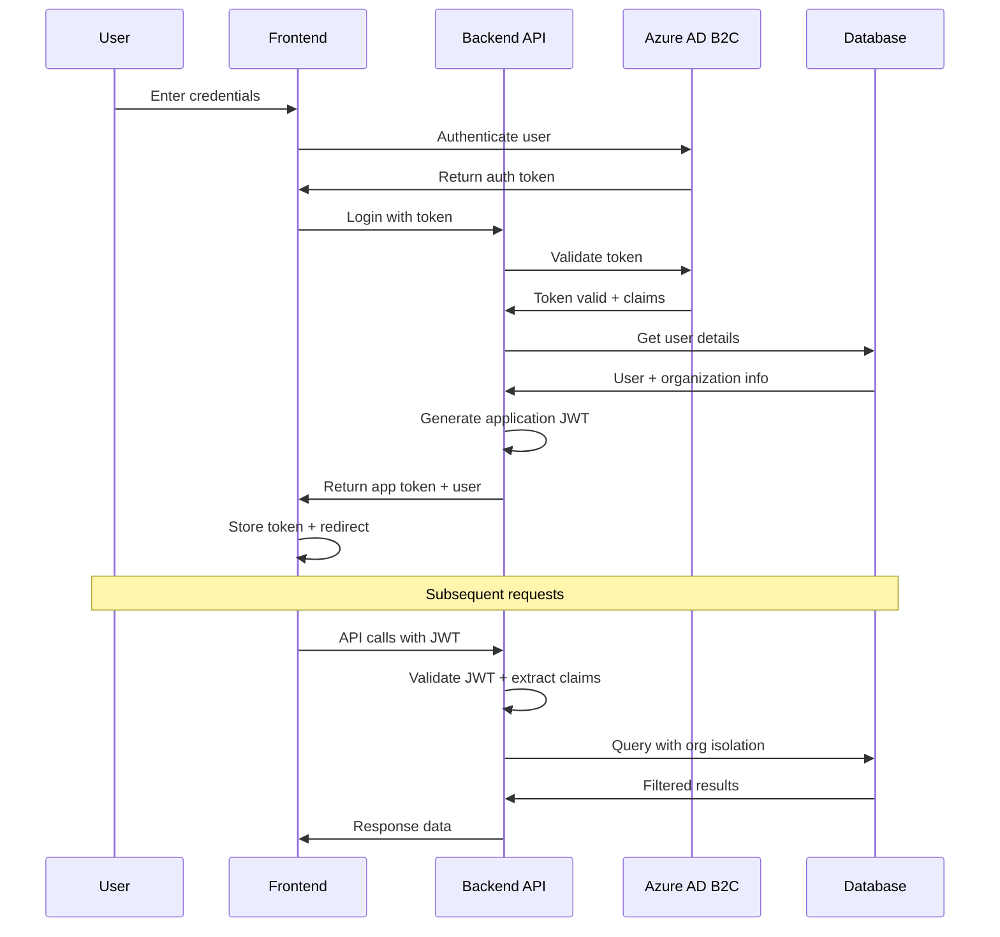

# Backend Architecture

## Service Architecture

### Traditional Server Organization
```
src/
├── Controllers/         # API endpoints and request handling
│   ├── AuthController.cs
│   ├── OrdersController.cs
│   ├── MeasurementsController.cs
│   └── PaymentsController.cs
├── Services/           # Business logic layer
│   ├── Interfaces/     # Service contracts
│   ├── OrderService.cs
│   ├── PaymentService.cs
│   └── NotificationService.cs
├── Models/             # Data models and DTOs
│   ├── Entities/       # Database entities
│   ├── DTOs/          # Data transfer objects
│   └── ViewModels/    # Response models
├── Data/              # Data access layer
│   ├── ApplicationDbContext.cs
│   ├── Repositories/   # Repository pattern
│   └── Migrations/    # EF Core migrations
├── Infrastructure/    # External service integrations
│   ├── Payment/       # Stripe integration
│   ├── Notifications/ # Email/SMS services
│   └── Storage/       # Blob storage
└── Common/            # Shared utilities
    ├── Extensions/
    ├── Middleware/
    └── Validators/
```

### Controller Template
```csharp
[ApiController]
[Route("api/[controller]")]
[Authorize]
public class OrdersController : ControllerBase
{
    private readonly IOrderService _orderService;
    private readonly ILogger<OrdersController> _logger;
    private readonly IMapper _mapper;

    public OrdersController(
        IOrderService orderService,
        ILogger<OrdersController> logger,
        IMapper mapper)
    {
        _orderService = orderService;
        _logger = logger;
        _mapper = mapper;
    }

    [HttpGet]
    public async Task<ActionResult<IEnumerable<OrderDto>>> GetOrders(
        [FromQuery] string? status = null,
        [FromQuery] string? stage = null)
    {
        try
        {
            var organizationId = GetCurrentOrganizationId();
            var orders = await _orderService.GetOrdersAsync(organizationId, status, stage);
            var orderDtos = _mapper.Map<IEnumerable<OrderDto>>(orders);
            
            return Ok(orderDtos);
        }
        catch (Exception ex)
        {
            _logger.LogError(ex, "Error retrieving orders for organization {OrganizationId}", 
                GetCurrentOrganizationId());
            return StatusCode(500, "An error occurred while retrieving orders");
        }
    }

    [HttpGet("{orderId:guid}")]
    public async Task<ActionResult<OrderDetailDto>> GetOrderDetail(Guid orderId)
    {
        try
        {
            var order = await _orderService.GetOrderDetailAsync(orderId);
            
            if (order == null)
            {
                return NotFound($"Order {orderId} not found");
            }

            // Verify organization access
            if (!HasAccessToOrder(order))
            {
                return Forbid("Access denied to this order");
            }

            var orderDetailDto = _mapper.Map<OrderDetailDto>(order);
            return Ok(orderDetailDto);
        }
        catch (Exception ex)
        {
            _logger.LogError(ex, "Error retrieving order detail for {OrderId}", orderId);
            return StatusCode(500, "An error occurred while retrieving order details");
        }
    }

    [HttpPatch("{orderId:guid}")]
    [Authorize(Roles = "ColorGarbStaff")]
    public async Task<IActionResult> UpdateOrderStage(
        Guid orderId, 
        [FromBody] UpdateOrderStageRequest request)
    {
        try
        {
            var userId = GetCurrentUserId();
            await _orderService.UpdateOrderStageAsync(
                orderId, 
                request.Stage, 
                request.ShipDate, 
                request.Reason, 
                userId);

            return NoContent();
        }
        catch (OrderNotFoundException)
        {
            return NotFound($"Order {orderId} not found");
        }
        catch (InvalidOperationException ex)
        {
            return BadRequest(ex.Message);
        }
        catch (Exception ex)
        {
            _logger.LogError(ex, "Error updating order stage for {OrderId}", orderId);
            return StatusCode(500, "An error occurred while updating order stage");
        }
    }

    private Guid GetCurrentOrganizationId()
    {
        var claim = User.FindFirst("OrganizationId");
        return Guid.Parse(claim?.Value ?? throw new UnauthorizedAccessException());
    }

    private Guid GetCurrentUserId()
    {
        var claim = User.FindFirst(ClaimTypes.NameIdentifier);
        return Guid.Parse(claim?.Value ?? throw new UnauthorizedAccessException());
    }

    private bool HasAccessToOrder(Order order)
    {
        var userRole = User.FindFirst(ClaimTypes.Role)?.Value;
        if (userRole == "ColorGarbStaff") return true;

        var organizationId = GetCurrentOrganizationId();
        return order.OrganizationId == organizationId;
    }
}
```

## Database Architecture

### Schema Design
```sql
-- Core business entity with comprehensive indexing
CREATE TABLE Orders (
    Id UNIQUEIDENTIFIER PRIMARY KEY DEFAULT NEWID(),
    OrderNumber NVARCHAR(50) NOT NULL UNIQUE,
    OrganizationId UNIQUEIDENTIFIER NOT NULL,
    Description NVARCHAR(500) NOT NULL,
    CurrentStage NVARCHAR(50) NOT NULL DEFAULT 'DesignProposal',
    OriginalShipDate DATETIME2 NOT NULL,
    CurrentShipDate DATETIME2 NOT NULL,
    TotalAmount DECIMAL(10,2) NOT NULL,
    Status NVARCHAR(50) NOT NULL DEFAULT 'Active',
    CreatedAt DATETIME2 NOT NULL DEFAULT GETUTCDATE(),
    UpdatedAt DATETIME2 NOT NULL DEFAULT GETUTCDATE(),
    
    FOREIGN KEY (OrganizationId) REFERENCES Organizations(Id),
    
    -- Performance indexes
    INDEX IX_Orders_Organization_Status (OrganizationId, Status),
    INDEX IX_Orders_Stage_ShipDate (CurrentStage, CurrentShipDate),
    INDEX IX_Orders_OrderNumber (OrderNumber)
);

-- Enable row-level security for organization isolation
ALTER TABLE Orders ENABLE ROW LEVEL SECURITY;

CREATE SECURITY POLICY OrganizationAccess ON Orders
    ADD FILTER PREDICATE (
        OrganizationId = CAST(SESSION_CONTEXT(N'OrganizationId') AS UNIQUEIDENTIFIER)
        OR CAST(SESSION_CONTEXT(N'UserRole') AS NVARCHAR(50)) = 'ColorGarbStaff'
    );
```

### Data Access Layer
```csharp
public interface IOrderRepository
{
    Task<IEnumerable<Order>> GetOrdersByOrganizationAsync(
        Guid organizationId, 
        string? status = null, 
        string? stage = null);
    Task<Order?> GetOrderByIdAsync(Guid orderId);
    Task<Order> CreateOrderAsync(Order order);
    Task UpdateOrderAsync(Order order);
    Task<bool> DeleteOrderAsync(Guid orderId);
}

public class OrderRepository : IOrderRepository
{
    private readonly ApplicationDbContext _context;
    private readonly ILogger<OrderRepository> _logger;

    public OrderRepository(ApplicationDbContext context, ILogger<OrderRepository> logger)
    {
        _context = context;
        _logger = logger;
    }

    public async Task<IEnumerable<Order>> GetOrdersByOrganizationAsync(
        Guid organizationId, 
        string? status = null, 
        string? stage = null)
    {
        var query = _context.Orders
            .Include(o => o.Organization)
            .Include(o => o.StageHistory)
            .Where(o => o.OrganizationId == organizationId);

        if (!string.IsNullOrEmpty(status))
        {
            query = query.Where(o => o.Status == status);
        }

        if (!string.IsNullOrEmpty(stage))
        {
            query = query.Where(o => o.CurrentStage == stage);
        }

        return await query
            .OrderByDescending(o => o.UpdatedAt)
            .ToListAsync();
    }

    public async Task<Order?> GetOrderByIdAsync(Guid orderId)
    {
        return await _context.Orders
            .Include(o => o.Organization)
            .Include(o => o.StageHistory)
            .Include(o => o.Measurements)
            .Include(o => o.Payments)
            .Include(o => o.Messages)
                .ThenInclude(m => m.Sender)
            .FirstOrDefaultAsync(o => o.Id == orderId);
    }

    public async Task<Order> CreateOrderAsync(Order order)
    {
        _context.Orders.Add(order);
        await _context.SaveChangesAsync();
        return order;
    }

    public async Task UpdateOrderAsync(Order order)
    {
        order.UpdatedAt = DateTime.UtcNow;
        _context.Orders.Update(order);
        await _context.SaveChangesAsync();
    }

    public async Task<bool> DeleteOrderAsync(Guid orderId)
    {
        var order = await _context.Orders.FindAsync(orderId);
        if (order == null) return false;

        _context.Orders.Remove(order);
        await _context.SaveChangesAsync();
        return true;
    }
}
```

## Authentication and Authorization

### Auth Flow


### Middleware/Guards
```csharp
public class OrganizationIsolationMiddleware
{
    private readonly RequestDelegate _next;
    private readonly ILogger<OrganizationIsolationMiddleware> _logger;

    public OrganizationIsolationMiddleware(
        RequestDelegate next, 
        ILogger<OrganizationIsolationMiddleware> logger)
    {
        _next = next;
        _logger = logger;
    }

    public async Task InvokeAsync(HttpContext context, ApplicationDbContext dbContext)
    {
        if (context.User.Identity?.IsAuthenticated == true)
        {
            var organizationId = context.User.FindFirst("OrganizationId")?.Value;
            var userRole = context.User.FindFirst(ClaimTypes.Role)?.Value;

            // Set session context for row-level security
            if (!string.IsNullOrEmpty(organizationId))
            {
                await dbContext.Database.ExecuteSqlRawAsync(
                    "EXEC sp_set_session_context @key = N'OrganizationId', @value = {0}",
                    organizationId);
            }

            await dbContext.Database.ExecuteSqlRawAsync(
                "EXEC sp_set_session_context @key = N'UserRole', @value = {0}",
                userRole ?? "Guest");

            _logger.LogDebug("Set session context: OrganizationId={OrganizationId}, Role={Role}", 
                organizationId, userRole);
        }

        await _next(context);
    }
}

[AttributeUsage(AttributeTargets.Class | AttributeTargets.Method)]
public class RequireRoleAttribute : Attribute, IAuthorizationRequirement
{
    public string[] Roles { get; }

    public RequireRoleAttribute(params string[] roles)
    {
        Roles = roles;
    }
}

public class RoleAuthorizationHandler : AuthorizationHandler<RequireRoleAttribute>
{
    protected override Task HandleRequirementAsync(
        AuthorizationHandlerContext context,
        RequireRoleAttribute requirement)
    {
        var userRole = context.User.FindFirst(ClaimTypes.Role)?.Value;

        if (userRole != null && requirement.Roles.Contains(userRole))
        {
            context.Succeed(requirement);
        }

        return Task.CompletedTask;
    }
}
```
