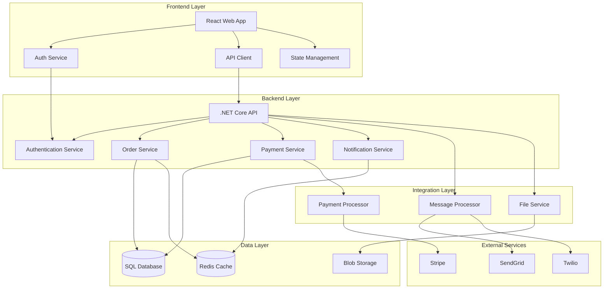

# Components

## Frontend Application (React)

**Responsibility:** Provides mobile-first user interface for order management, communication, and approval workflows with role-based views and real-time updates

**Key Interfaces:**
- REST API client for backend communication
- Azure AD B2C integration for authentication
- WebSocket connection for real-time notifications
- File upload interface for measurements and documents

**Dependencies:** Backend API, Azure AD B2C, CDN for static assets

**Technology Stack:** React 18, TypeScript, Material-UI, Zustand state management, Vite build system, deployed as Azure Static Web App

## Backend API (.NET Core)

**Responsibility:** Handles business logic, data persistence, authentication/authorization, and external service integration with comprehensive audit trails and role-based security

**Key Interfaces:**
- RESTful HTTP API endpoints
- Azure SQL Database integration
- Service Bus message publishing
- External payment and notification APIs

**Dependencies:** Azure SQL Database, Redis cache, Service Bus, external APIs (Stripe, SendGrid, Twilio)

**Technology Stack:** .NET Core 7, Entity Framework Core, Azure Service Bus SDK, Serilog logging, deployed as Azure App Service

## Message Processing Service

**Responsibility:** Processes notification events from Service Bus to deliver email/SMS notifications with retry logic and delivery tracking

**Key Interfaces:**
- Service Bus message consumption
- SendGrid Email API integration
- Twilio SMS API integration
- Notification delivery status tracking

**Dependencies:** Service Bus, SendGrid, Twilio, Redis for delivery tracking

**Technology Stack:** .NET Core background service, Azure Service Bus, SendGrid/Twilio SDKs

## File Storage Service

**Responsibility:** Manages secure document storage for measurements, proofs, and order documents with access control and CDN integration

**Key Interfaces:**
- Azure Blob Storage integration
- Secure file upload/download APIs
- CDN integration for performance
- File access authorization

**Dependencies:** Azure Blob Storage, Azure CDN, Backend API for authorization

**Technology Stack:** Azure Blob Storage with CDN, integrated with main API service

## External Integration Layer

**Responsibility:** Manages connections to payment processors, shipping APIs, and notification services with error handling and retry logic

**Key Interfaces:**
- Stripe payment processing API
- Shipping carrier APIs for tracking
- Email/SMS service provider APIs
- Webhook endpoints for external notifications

**Dependencies:** External service providers, Backend API for data persistence

**Technology Stack:** HTTP clients with Polly retry policies, webhook handlers, secure credential management

## Component Diagrams

