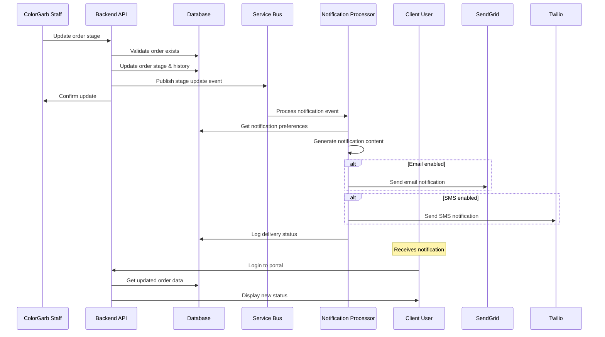
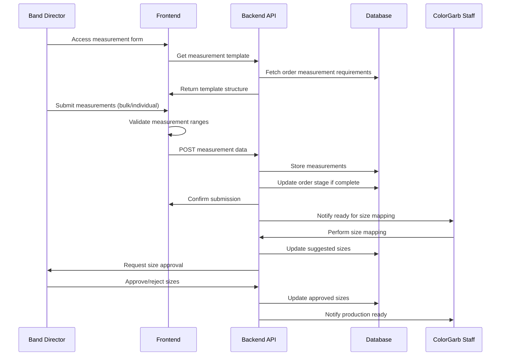
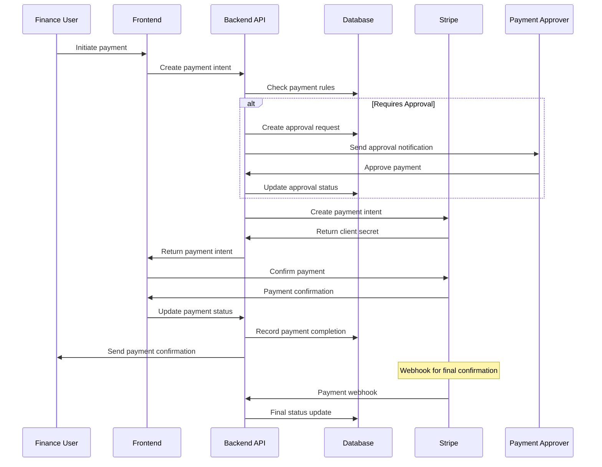

# Core Workflows

## Order Status Update Workflow

```mermaid
sequenceDiagram
    participant CS as ColorGarb Staff
    participant API as Backend API
    participant DB as Database
    participant SB as Service Bus
    participant NP as Notification Processor
    participant CLIENT as Client User

    CS->>API: Update order stage
    API->>DB: Validate order exists
    API->>DB: Update order stage & history
    API->>SB: Publish stage update event
    API->>CS: Confirm update
    
    SB->>NP: Process notification event
    NP->>DB: Get notification preferences
    NP->>NP: Generate notification content
    
    alt Email enabled
        NP->>SendGrid: Send email notification
    end
    
    alt SMS enabled  
        NP->>Twilio: Send SMS notification
    end
    
    NP->>DB: Log delivery status
    
    Note over CLIENT: Receives notification
    CLIENT->>API: Login to portal
    API->>DB: Get updated order data
    API->>CLIENT: Display new status
```

## Measurement Submission Workflow

```mermaid
sequenceDiagram
    participant USER as Band Director
    participant WEB as Frontend
    participant API as Backend API
    participant DB as Database
    participant CS as ColorGarb Staff

    USER->>WEB: Access measurement form
    WEB->>API: Get measurement template
    API->>DB: Fetch order measurement requirements
    API->>WEB: Return template structure
    
    USER->>WEB: Submit measurements (bulk/individual)
    WEB->>WEB: Validate measurement ranges
    WEB->>API: POST measurement data
    
    API->>DB: Store measurements
    API->>DB: Update order stage if complete
    API->>WEB: Confirm submission
    
    API->>CS: Notify ready for size mapping
    CS->>API: Perform size mapping
    API->>DB: Update suggested sizes
    
    API->>USER: Request size approval
    USER->>API: Approve/reject sizes
    API->>DB: Update approved sizes
    API->>CS: Notify production ready
```

## Payment Processing Workflow

```mermaid
sequenceDiagram
    participant USER as Finance User
    participant WEB as Frontend
    participant API as Backend API
    participant DB as Database
    participant STRIPE as Stripe
    participant APPROVER as Payment Approver

    USER->>WEB: Initiate payment
    WEB->>API: Create payment intent
    API->>DB: Check payment rules
    
    alt Requires Approval
        API->>DB: Create approval request
        API->>APPROVER: Send approval notification
        APPROVER->>API: Approve payment
        API->>DB: Update approval status
    end
    
    API->>STRIPE: Create payment intent
    STRIPE->>API: Return client secret
    API->>WEB: Return payment intent
    
    WEB->>STRIPE: Confirm payment
    STRIPE->>WEB: Payment confirmation
    WEB->>API: Update payment status
    
    API->>DB: Record payment completion
    API->>USER: Send payment confirmation
    
    Note over STRIPE: Webhook for final confirmation
    STRIPE->>API: Payment webhook
    API->>DB: Final status update
```
