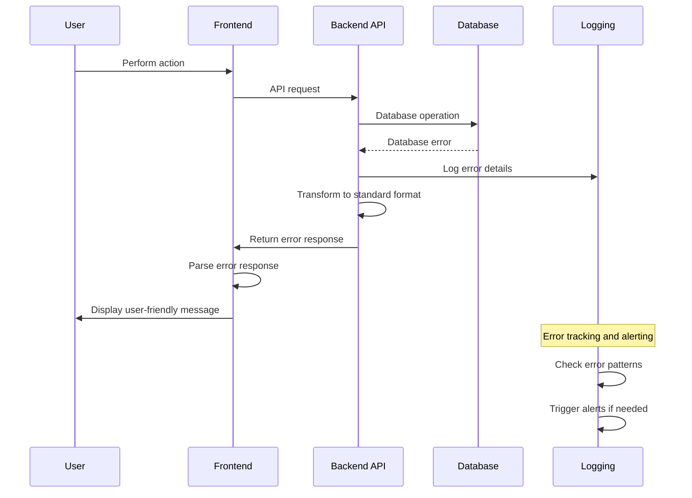

# Error Handling Strategy

## Error Flow



## Error Response Format

```typescript
interface ApiError {
  error: {
    code: string;           // Machine-readable error code
    message: string;        // Human-readable error message
    details?: Record<string, any>; // Additional error context
    timestamp: string;      // ISO 8601 timestamp
    requestId: string;      // Unique request identifier for tracing
    validationErrors?: {    // Field-specific validation errors
      field: string;
      message: string;
      code: string;
    }[];
  };
}

// Example error responses
const examples = {
  validationError: {
    error: {
      code: "VALIDATION_FAILED",
      message: "One or more fields contain invalid data",
      details: { attemptedAction: "measurementSubmission" },
      timestamp: "2023-08-22T10:30:00.000Z",
      requestId: "req_abc123def456",
      validationErrors: [
        {
          field: "measurements.chest",
          message: "Chest measurement must be between 20 and 60 inches",
          code: "OUT_OF_RANGE"
        },
        {
          field: "performerName",
          message: "Performer name is required",
          code: "REQUIRED_FIELD"
        }
      ]
    }
  },
  authorizationError: {
    error: {
      code: "INSUFFICIENT_PERMISSIONS",
      message: "You do not have permission to access this order",
      details: { requiredRole: "ColorGarbStaff", userRole: "Director" },
      timestamp: "2023-08-22T10:30:00.000Z",
      requestId: "req_def456ghi789"
    }
  },
  paymentError: {
    error: {
      code: "PAYMENT_FAILED",
      message: "Payment could not be processed",
      details: { 
        paymentMethod: "credit_card",
        stripeErrorCode: "card_declined",
        attemptedAmount: 1500.00
      },
      timestamp: "2023-08-22T10:30:00.000Z",
      requestId: "req_ghi789jkl012"
    }
  }
};
```

## Frontend Error Handling

```typescript
// Frontend error handling service
class ErrorHandlingService {
  private notificationService: NotificationService;

  constructor(notificationService: NotificationService) {
    this.notificationService = notificationService;
  }

  handleApiError(error: AxiosError<ApiError>): void {
    const apiError = error.response?.data?.error;
    
    if (!apiError) {
      this.handleNetworkError(error);
      return;
    }

    switch (apiError.code) {
      case 'VALIDATION_FAILED':
        this.handleValidationError(apiError);
        break;
      
      case 'INSUFFICIENT_PERMISSIONS':
        this.handleAuthorizationError(apiError);
        break;
      
      case 'PAYMENT_FAILED':
        this.handlePaymentError(apiError);
        break;
      
      case 'MEASUREMENT_OUT_OF_RANGE':
        this.handleMeasurementError(apiError);
        break;
      
      default:
        this.handleGenericError(apiError);
    }

    // Log error for debugging (exclude sensitive data)
    console.error('API Error:', {
      code: apiError.code,
      message: apiError.message,
      requestId: apiError.requestId,
      timestamp: apiError.timestamp
    });
  }

  private handleValidationError(error: ApiError['error']): void {
    if (error.validationErrors) {
      // Display field-specific errors
      error.validationErrors.forEach(validationError => {
        this.notificationService.showFieldError(
          validationError.field,
          validationError.message
        );
      });
    } else {
      this.notificationService.showError(
        'Please check your input and try again',
        { duration: 5000 }
      );
    }
  }

  private handleAuthorizationError(error: ApiError['error']): void {
    this.notificationService.showError(
      'You do not have permission to perform this action',
      { 
        duration: 8000,
        action: {
          label: 'Contact Support',
          onClick: () => this.openSupportDialog(error.requestId)
        }
      }
    );
  }

  private handlePaymentError(error: ApiError['error']): void {
    const details = error.details as any;
    let message = 'Payment could not be processed';
    
    if (details?.stripeErrorCode === 'card_declined') {
      message = 'Your card was declined. Please try a different payment method.';
    } else if (details?.stripeErrorCode === 'insufficient_funds') {
      message = 'Insufficient funds. Please check your account balance.';
    }

    this.notificationService.showError(message, {
      duration: 10000,
      action: {
        label: 'Try Again',
        onClick: () => window.location.reload()
      }
    });
  }

  private handleMeasurementError(error: ApiError['error']): void {
    this.notificationService.showWarning(
      'Some measurements are outside normal ranges. Please verify accuracy.',
      {
        duration: 8000,
        action: {
          label: 'Review Measurements',
          onClick: () => this.scrollToMeasurementSection()
        }
      }
    );
  }

  private handleNetworkError(error: AxiosError): void {
    if (!navigator.onLine) {
      this.notificationService.showError(
        'No internet connection. Please check your network and try again.',
        { duration: 'indefinite' }
      );
    } else if (error.code === 'ECONNABORTED') {
      this.notificationService.showError(
        'Request timed out. Please try again.',
        { duration: 6000 }
      );
    } else {
      this.notificationService.showError(
        'Unable to connect to server. Please try again in a moment.',
        { duration: 6000 }
      );
    }
  }

  private handleGenericError(error: ApiError['error']): void {
    this.notificationService.showError(
      'An unexpected error occurred. Please try again.',
      {
        duration: 6000,
        action: {
          label: 'Report Issue',
          onClick: () => this.openSupportDialog(error.requestId)
        }
      }
    );
  }
}

// React hook for error handling
export const useErrorHandler = () => {
  const errorService = useRef(new ErrorHandlingService(notificationService));

  return useCallback((error: AxiosError<ApiError>) => {
    errorService.current.handleApiError(error);
  }, []);
};

// Usage in components
const OrderDetail: React.FC<{ orderId: string }> = ({ orderId }) => {
  const handleError = useErrorHandler();
  const [order, setOrder] = useState<OrderDetail | null>(null);

  useEffect(() => {
    orderService.getOrderDetail(orderId)
      .then(setOrder)
      .catch(handleError); // Centralized error handling
  }, [orderId, handleError]);

  return (
    <div>
      {/* Component JSX */}
    </div>
  );
};
```

## Backend Error Handling

```csharp
// Global exception handling middleware
public class GlobalExceptionHandlingMiddleware
{
    private readonly RequestDelegate _next;
    private readonly ILogger<GlobalExceptionHandlingMiddleware> _logger;

    public GlobalExceptionHandlingMiddleware(
        RequestDelegate next,
        ILogger<GlobalExceptionHandlingMiddleware> logger)
    {
        _next = next;
        _logger = logger;
    }

    public async Task InvokeAsync(HttpContext context)
    {
        try
        {
            await _next(context);
        }
        catch (Exception ex)
        {
            _logger.LogError(ex, "An unhandled exception occurred for request {RequestId}", 
                context.TraceIdentifier);
            
            await HandleExceptionAsync(context, ex);
        }
    }

    private static async Task HandleExceptionAsync(HttpContext context, Exception exception)
    {
        var response = context.Response;
        response.ContentType = "application/json";

        var errorResponse = new ApiErrorResponse
        {
            Error = new ApiError
            {
                RequestId = context.TraceIdentifier,
                Timestamp = DateTime.UtcNow.ToString("O")
            }
        };

        switch (exception)
        {
            case ValidationException validationEx:
                response.StatusCode = 400;
                errorResponse.Error.Code = "VALIDATION_FAILED";
                errorResponse.Error.Message = "One or more fields contain invalid data";
                errorResponse.Error.ValidationErrors = validationEx.Errors
                    .Select(e => new ValidationError
                    {
                        Field = e.PropertyName,
                        Message = e.ErrorMessage,
                        Code = e.ErrorCode ?? "INVALID_VALUE"
                    }).ToArray();
                break;

            case UnauthorizedAccessException:
                response.StatusCode = 401;
                errorResponse.Error.Code = "UNAUTHORIZED";
                errorResponse.Error.Message = "Authentication required";
                break;

            case InsufficientPermissionsException permEx:
                response.StatusCode = 403;
                errorResponse.Error.Code = "INSUFFICIENT_PERMISSIONS";
                errorResponse.Error.Message = "You do not have permission to perform this action";
                errorResponse.Error.Details = new Dictionary<string, object>
                {
                    { "requiredRole", permEx.RequiredRole },
                    { "userRole", permEx.UserRole }
                };
                break;

            case OrderNotFoundException:
                response.StatusCode = 404;
                errorResponse.Error.Code = "ORDER_NOT_FOUND";
                errorResponse.Error.Message = "The requested order could not be found";
                break;

            case PaymentProcessingException paymentEx:
                response.StatusCode = 400;
                errorResponse.Error.Code = "PAYMENT_FAILED";
                errorResponse.Error.Message = "Payment could not be processed";
                errorResponse.Error.Details = new Dictionary<string, object>
                {
                    { "paymentMethod", paymentEx.PaymentMethod },
                    { "stripeErrorCode", paymentEx.StripeErrorCode ?? "unknown" },
                    { "attemptedAmount", paymentEx.Amount }
                };
                break;

            case MeasurementValidationException measurementEx:
                response.StatusCode = 400;
                errorResponse.Error.Code = "MEASUREMENT_OUT_OF_RANGE";
                errorResponse.Error.Message = "Some measurements are outside acceptable ranges";
                errorResponse.Error.Details = new Dictionary<string, object>
                {
                    { "invalidMeasurements", measurementEx.InvalidMeasurements }
                };
                break;

            default:
                response.StatusCode = 500;
                errorResponse.Error.Code = "INTERNAL_SERVER_ERROR";
                errorResponse.Error.Message = "An unexpected error occurred";
                
                // Don't expose internal error details in production
                if (!context.RequestServices.GetService<IWebHostEnvironment>()!.IsProduction())
                {
                    errorResponse.Error.Details = new Dictionary<string, object>
                    {
                        { "exceptionType", exception.GetType().Name },
                        { "stackTrace", exception.StackTrace ?? "No stack trace available" }
                    };
                }
                break;
        }

        var jsonResponse = JsonSerializer.Serialize(errorResponse, new JsonSerializerOptions
        {
            PropertyNamingPolicy = JsonNamingPolicy.CamelCase
        });

        await response.WriteAsync(jsonResponse);
    }
}

// Custom exception classes
public class ValidationException : Exception
{
    public IEnumerable<ValidationFailure> Errors { get; }

    public ValidationException(IEnumerable<ValidationFailure> errors) 
        : base("Validation failed")
    {
        Errors = errors;
    }
}

public class InsufficientPermissionsException : Exception
{
    public string RequiredRole { get; }
    public string UserRole { get; }

    public InsufficientPermissionsException(string requiredRole, string userRole) 
        : base($"Insufficient permissions. Required: {requiredRole}, User: {userRole}")
    {
        RequiredRole = requiredRole;
        UserRole = userRole;
    }
}

public class PaymentProcessingException : Exception
{
    public string PaymentMethod { get; }
    public string? StripeErrorCode { get; }
    public decimal Amount { get; }

    public PaymentProcessingException(
        string paymentMethod, 
        decimal amount, 
        string? stripeErrorCode = null) 
        : base("Payment processing failed")
    {
        PaymentMethod = paymentMethod;
        Amount = amount;
        StripeErrorCode = stripeErrorCode;
    }
}

// Service-level error handling
public class OrderService : IOrderService
{
    public async Task<Order> UpdateOrderStageAsync(
        Guid orderId, 
        string stage, 
        DateTime? shipDate, 
        string? reason, 
        Guid updatedBy)
    {
        var order = await _orderRepository.GetOrderByIdAsync(orderId);
        if (order == null)
        {
            throw new OrderNotFoundException($"Order {orderId} not found");
        }

        // Validate stage transition
        if (!IsValidStageTransition(order.CurrentStage, stage))
        {
            throw new ValidationException(new[]
            {
                new ValidationFailure("stage", 
                    $"Cannot transition from {order.CurrentStage} to {stage}")
                {
                    ErrorCode = "INVALID_STAGE_TRANSITION"
                }
            });
        }

        // Update order
        order.CurrentStage = stage;
        if (shipDate.HasValue)
        {
            order.CurrentShipDate = shipDate.Value;
        }

        // Add to history
        order.StageHistory.Add(new OrderStageHistory
        {
            OrderId = orderId,
            Stage = stage,
            EnteredAt = DateTime.UtcNow,
            UpdatedBy = updatedBy,
            Notes = reason,
            PreviousShipDate = order.CurrentShipDate,
            NewShipDate = shipDate
        });

        await _orderRepository.UpdateOrderAsync(order);

        // Trigger notifications
        await _notificationService.SendStageUpdateNotificationAsync(order);

        return order;
    }
}
```
