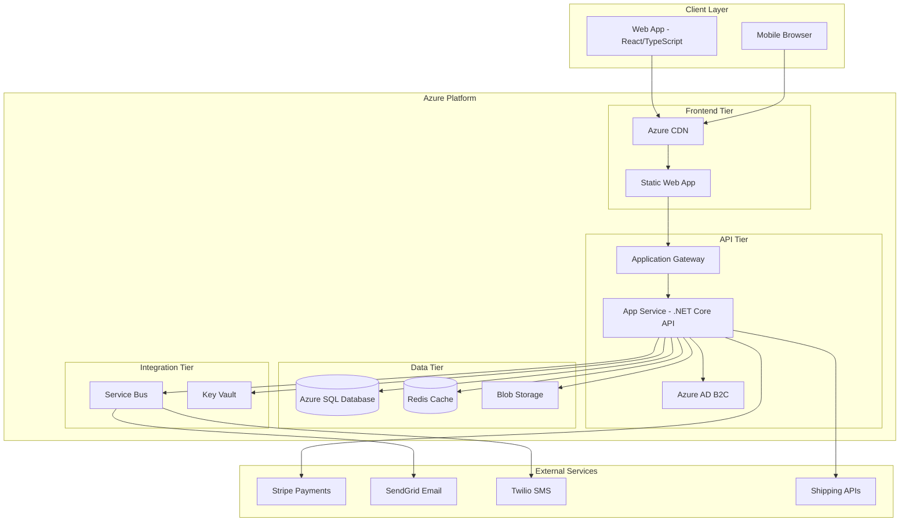

# High Level Architecture

## Technical Summary

The ColorGarb Client Portal employs a modern fullstack architecture using React/TypeScript frontend with .NET Core Web API backend, deployed on Azure using a microservices-ready monolithic structure. The system integrates Azure SQL Database for transactional data, Redis for caching and real-time features, and Azure Service Bus for reliable notification delivery. Key integration points include Stripe for payments, SendGrid for email notifications, and Twilio for SMS, all orchestrated through a secure API gateway pattern that enforces role-based access control and organization-based data isolation. This architecture achieves the PRD goals of 75% communication overhead reduction and 50% client base expansion through automated workflows, transparent order tracking, and mobile-optimized user experiences.

## Platform and Infrastructure Choice

**Platform:** Microsoft Azure  
**Key Services:** App Service (Frontend/Backend), Azure SQL Database, Redis Cache, Service Bus, Blob Storage, Application Gateway, Key Vault  
**Deployment Host and Regions:** Azure App Service in East US (primary) and West US (backup) for high availability

**Rationale:** Azure chosen for strong .NET Core integration, comprehensive PaaS offerings, enterprise-grade security features required for FERPA/PCI compliance, and cost-effective scaling options suitable for the 500+ concurrent user requirement.

## Repository Structure

**Structure:** Monorepo with clear separation of concerns  
**Monorepo Tool:** .NET Solution structure with npm workspaces for frontend packages  
**Package Organization:** Apps (web frontend, API backend), Packages (shared types, common utilities), Infrastructure (ARM templates, deployment scripts)

## High Level Architecture Diagram

## Architectural Patterns

- **Jamstack Architecture:** Static frontend with serverless-style API integration - _Rationale:_ Optimal performance and scalability for content-heavy client portal with mobile-first requirements
- **API Gateway Pattern:** Single entry point through Azure Application Gateway - _Rationale:_ Centralized authentication, rate limiting, and SSL termination for enterprise security
- **Repository Pattern:** Abstract data access logic in .NET Core - _Rationale:_ Enables comprehensive testing and future database migration flexibility
- **CQRS Light:** Separate read/write models for complex queries - _Rationale:_ Optimizes performance for dashboard queries while maintaining simple command operations
- **Event-Driven Notifications:** Service Bus for reliable message delivery - _Rationale:_ Ensures critical notifications (ship date changes, payment confirmations) are delivered even during system maintenance
- **Role-Based Security:** Claims-based authorization with organization isolation - _Rationale:_ Enforces strict data separation between client organizations while enabling ColorGarb staff administrative access
