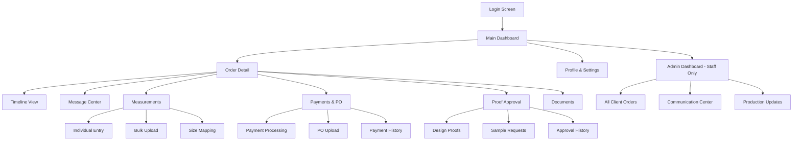
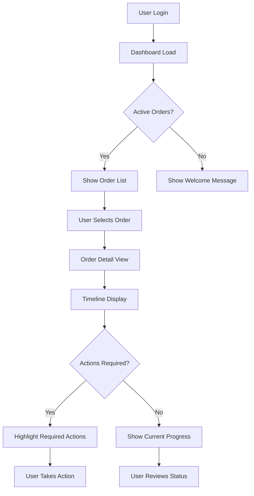
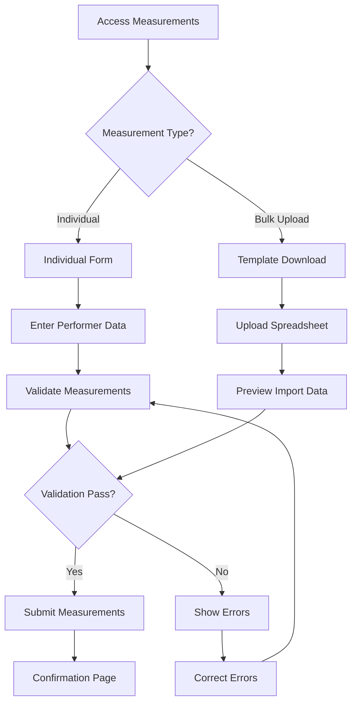
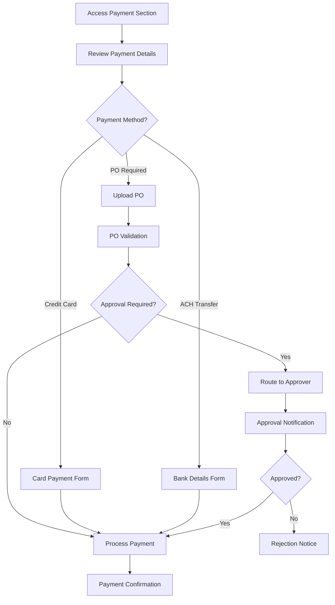

# ColorGarb Client Portal UI/UX Specification

## Introduction

This document defines the user experience goals, information architecture, user flows, and visual design specifications for ColorGarb Client Portal's user interface. It serves as the foundation for visual design and frontend development, ensuring a cohesive and user-centered experience.

The ColorGarb Client Portal transforms custom costume manufacturing from a manual, email-heavy process into a transparent, efficient digital experience. This mobile-first platform serves band directors, finance users, and ColorGarb staff with role-based access to order tracking, communication, and approval workflows.

### Overall UX Goals & Principles

#### Target User Personas

**Band Director:** Music education professionals managing 50-200+ performer costume orders. They work primarily from mobile devices in field environments (rehearsal halls, stadiums) and need quick access to order status, deadlines, and communication tools. High stress about delivery timing for performance dates.

**Finance User:** School/booster organization financial administrators who handle purchase orders, payment approvals, and budget compliance. They need clear audit trails, approval workflows, and integration with existing financial processes.

**ColorGarb Staff:** Customer service and production staff who manage multiple client orders simultaneously. They need administrative oversight, communication tools, and the ability to update order progress efficiently across all client organizations.

#### Usability Goals

- **Immediate Orientation:** New users can understand their order status and next required actions within 30 seconds of login
- **Mobile Efficiency:** Band directors can complete critical tasks (check status, approve proofs, submit measurements) in under 2 minutes on mobile devices
- **Communication Clarity:** 90% reduction in "when will my order ship?" inquiries through transparent timeline visibility
- **Error Prevention:** Validation and confirmation workflows prevent costly measurement errors and payment processing issues
- **Stress Reduction:** Clear deadline tracking and proactive notifications eliminate anxiety about performance date delivery

#### Design Principles

1. **Timeline Transparency** - Every order shows clear visual progress through the 13-stage manufacturing process with realistic expectations
2. **Mobile-First Efficiency** - All critical functions optimized for thumb-friendly mobile interaction with field-ready performance
3. **Role-Based Clarity** - Interface adapts to show only relevant information and actions for each user's responsibilities
4. **Proactive Communication** - System anticipates user needs and provides information before it's requested
5. **Trust Through Visibility** - Open access to order details, communication history, and change documentation builds confidence

#### Change Log

| Date | Version | Description | Author |
|------|---------|-------------|---------|
| 2025-08-22 | v1.0 | Initial UI/UX specification creation | Sally (UX Expert) |

## Information Architecture (IA)

### Site Map / Screen Inventory

### Navigation Structure

**Primary Navigation:** Bottom tab bar for mobile with Dashboard, Orders, Messages, Profile. Desktop shows horizontal navigation with same sections plus Admin access for ColorGarb staff.

**Secondary Navigation:** Context-sensitive action buttons within each order detail view. Breadcrumb navigation for desktop users navigating deep into order sections.

**Breadcrumb Strategy:** Mobile relies on back button and contextual headers. Desktop shows full breadcrumb path: Dashboard > Order #12345 > Measurements for clear navigation hierarchy.

## User Flows

### Order Status Check Flow

**User Goal:** Quickly check the current status of active orders and understand next steps

**Entry Points:** Login screen, dashboard refresh, notification links

**Success Criteria:** User sees current stage, timeline progress, and any required actions within 30 seconds

#### Flow Diagram

#### Edge Cases & Error Handling:
- **Network timeout during dashboard load:** Show cached data with sync indicator
- **No active orders:** Display welcome message with contact information
- **Order data inconsistency:** Show last known status with refresh option
- **Required action deadline passed:** Highlight urgency and provide contact method

**Notes:** Flow optimized for mobile-first with minimal taps to reach critical information. Desktop version adds quick preview capabilities.

### Measurement Submission Flow

**User Goal:** Submit accurate measurements for all performers efficiently

**Entry Points:** Order detail page, notification link, dashboard measurement reminder

**Success Criteria:** All measurements validated and submitted with confirmation

#### Flow Diagram

#### Edge Cases & Error Handling:
- **Invalid measurement ranges:** Show acceptable ranges with measurement guide
- **Incomplete performer list:** Allow partial submission with missing performer tracking
- **File upload failure:** Provide manual entry fallback option
- **Size mapping conflicts:** Route to ColorGarb staff for custom size consultation

**Notes:** Dual-path design accommodates both small programs (individual entry) and large programs (bulk upload) with appropriate validation for each method.

### Payment Processing Flow

**User Goal:** Complete secure payment for costume order following organization's financial policies

**Entry Points:** Order detail payment section, invoice notification, payment reminder

**Success Criteria:** Payment processed successfully with proper documentation and approval trail

#### Flow Diagram

#### Edge Cases & Error Handling:
- **Payment processing failure:** Retry with alternative method options
- **PO number conflict:** Validation against existing PO database
- **Approval timeout:** Escalation to backup approver
- **Insufficient funds:** Clear error message with alternative payment options

**Notes:** Flow accommodates complex organizational approval workflows common in educational institutions while maintaining payment security standards.

## Wireframes & Mockups

**Primary Design Files:** Designs will be created in Figma with mobile-first approach, progressing to tablet and desktop layouts

### Key Screen Layouts

#### Login Screen
**Purpose:** Secure authentication with organization-based access

**Key Elements:**
- ColorGarb logo and branding
- Email/password input fields with validation
- "Forgot Password" link with email recovery
- Remember me checkbox for convenience

**Interaction Notes:** Auto-focus on email field, validation feedback on blur, loading states during authentication

**Design File Reference:** [Figma frame will be linked here]

#### Main Dashboard
**Purpose:** Quick overview of all active orders with status indicators and required actions

**Key Elements:**
- Header with user name and organization
- Order cards showing order number, description, current stage, and next action
- Bottom navigation for mobile (Dashboard, Orders, Messages, Profile)
- Search and filter options for large order lists

**Interaction Notes:** Pull-to-refresh gesture, card tap to enter order detail, notification badges for required actions

**Design File Reference:** [Figma frame will be linked here]

#### Order Detail Page
**Purpose:** Comprehensive workspace for all order-related information and actions

**Key Elements:**
- Order header with key details and current stage indicator
- 13-stage timeline visualization with progress indicators
- Tabbed sections for Timeline, Messages, Measurements, Payments, Documents
- Floating action button for most common next step

**Interaction Notes:** Horizontal scroll for timeline on mobile, tab navigation with swipe gestures, contextual action buttons

**Design File Reference:** [Figma frame will be linked here]

#### Measurement Collection Page
**Purpose:** Efficient measurement data entry with validation and bulk import capabilities

**Key Elements:**
- Toggle between individual entry and bulk upload modes
- Form fields with measurement validation and helper text
- Progress indicator showing completion status
- Template download link for bulk upload

**Interaction Notes:** Numeric keypad for measurement fields, save draft functionality, clear error messaging with correction guidance

**Design File Reference:** [Figma frame will be linked here]

## Component Library / Design System

**Design System Approach:** Create custom component library based on Material Design principles adapted for costume industry workflows. Focus on mobile-first components with accessibility built-in.

### Core Components

#### Timeline Component
**Purpose:** Visual representation of 13-stage manufacturing progress

**Variants:** Horizontal (mobile), vertical (desktop), compact (dashboard preview)

**States:** Current, completed, pending, delayed, blocked

**Usage Guidelines:** Always show stage names, use consistent iconography, provide estimated completion dates where available

#### Order Card Component
**Purpose:** Dashboard display of order summary information

**Variants:** Standard, compact, featured (urgent actions)

**States:** Normal, requires action, delayed, completed

**Usage Guidelines:** Consistent layout for scanability, clear action indicators, touch-friendly sizing

#### Status Badge Component
**Purpose:** Quick visual indicator of order or payment status

**Variants:** Success, warning, error, info, pending

**States:** Static display, animated (processing), with notification count

**Usage Guidelines:** Use sparingly for high-priority information, maintain color consistency with system palette

#### Navigation Tab Component
**Purpose:** Primary navigation for order detail sections

**Variants:** Bottom tabs (mobile), top tabs (desktop), with notification badges

**States:** Active, inactive, disabled, with notification count

**Usage Guidelines:** Limit to 5 tabs maximum, use icons with labels, maintain thumb-friendly touch targets

## Branding & Style Guide

### Visual Identity
**Brand Guidelines:** Maintain consistency with existing ColorGarb branding while establishing digital-first design language that conveys professionalism, reliability, and innovation

### Color Palette

| Color Type | Hex Code | Usage |
|------------|----------|--------|
| Primary | #1B365D | Header backgrounds, primary buttons, active states |
| Secondary | #4A90B8 | Links, secondary actions, progress indicators |
| Accent | #F39C12 | Attention-grabbing elements, notifications, warnings |
| Success | #27AE60 | Completed stages, successful payments, approvals |
| Warning | #F39C12 | Pending actions, approaching deadlines |
| Error | #E74C3C | Errors, failed payments, rejected items |
| Neutral | #34495E, #7F8C8D, #BDC3C7, #ECF0F1 | Text hierarchy, borders, backgrounds |

### Typography

#### Font Families
- **Primary:** Inter (web font) - Clean, readable sans-serif optimized for digital interfaces
- **Secondary:** System UI fonts as fallback for performance
- **Monospace:** Monaco, 'Cascadia Code' for order numbers and technical data

#### Type Scale

| Element | Size | Weight | Line Height |
|---------|------|--------|-------------|
| H1 | 28px | 700 | 1.2 |
| H2 | 24px | 600 | 1.25 |
| H3 | 20px | 600 | 1.3 |
| Body | 16px | 400 | 1.5 |
| Small | 14px | 400 | 1.4 |

### Iconography
**Icon Library:** Feather Icons for consistent line-style iconography with ColorGarb custom icons for industry-specific elements (costumes, measurements, timeline stages)

**Usage Guidelines:** 24px standard size for touch targets, 16px for inline text icons, maintain consistent stroke width, use sparingly to avoid visual clutter

### Spacing & Layout
**Grid System:** 8px base grid system with 16px, 24px, 32px common spacing values

**Spacing Scale:** 4px, 8px, 16px, 24px, 32px, 48px, 64px for consistent component spacing and layout rhythm

## Accessibility Requirements

### Compliance Target
**Standard:** WCAG 2.1 AA compliance to ensure accessibility for all users including those with disabilities

### Key Requirements

**Visual:**
- Color contrast ratios: 4.5:1 minimum for normal text, 3:1 for large text
- Focus indicators: 2px solid outline with high contrast color
- Text sizing: Supports 200% zoom without horizontal scrolling

**Interaction:**
- Keyboard navigation: Full functionality accessible via keyboard with logical tab order
- Screen reader support: Semantic HTML, ARIA labels, descriptive alt text
- Touch targets: Minimum 44px touch target size for mobile interface

**Content:**
- Alternative text: Descriptive alt text for all images, icons, and visual elements
- Heading structure: Logical heading hierarchy (H1-H6) for screen reader navigation
- Form labels: Clear, descriptive labels for all form inputs with error messaging

### Testing Strategy
Automated accessibility testing integrated into CI/CD pipeline with manual testing using screen readers (NVDA, VoiceOver) and keyboard-only navigation validation for all critical user flows.

## Responsiveness Strategy

### Breakpoints

| Breakpoint | Min Width | Max Width | Target Devices |
|------------|-----------|-----------|----------------|
| Mobile | 320px | 767px | Smartphones, small tablets |
| Tablet | 768px | 1023px | Tablets, small laptops |
| Desktop | 1024px | 1439px | Laptops, desktop monitors |
| Wide | 1440px | - | Large monitors, widescreen displays |

### Adaptation Patterns

**Layout Changes:** Single column mobile layout expanding to multi-column layouts on larger screens. Timeline component transitions from horizontal scroll (mobile) to vertical display (desktop).

**Navigation Changes:** Bottom tab navigation on mobile transforms to horizontal navigation bar on desktop. Hamburger menu for secondary navigation items on mobile.

**Content Priority:** Progressive disclosure hides less critical information on mobile with expand/collapse patterns. Dashboard shows more order details on larger screens.

**Interaction Changes:** Touch-optimized interactions on mobile (swipe, tap, long-press) with mouse hover states and keyboard shortcuts on desktop.

## Animation & Micro-interactions

### Motion Principles
Subtle, purposeful animations that enhance usability without distraction. Focus on providing feedback for user actions, indicating loading states, and guiding attention to important changes. All animations respect user's reduced motion preferences.

### Key Animations
- **Timeline Progress:** Smooth progress indicator animation when stages update (Duration: 300ms, Easing: ease-out)
- **Card Interactions:** Subtle hover and tap feedback for order cards (Duration: 150ms, Easing: ease-in-out)
- **Loading States:** Skeleton loading for content areas and spinner for actions (Duration: Continuous, Easing: linear)
- **Notification Slide:** Notification messages slide in from top with gentle bounce (Duration: 400ms, Easing: ease-back)
- **Form Validation:** Error state transitions with color and icon changes (Duration: 200ms, Easing: ease-out)

## Performance Considerations

### Performance Goals
- **Page Load:** Under 2 seconds for dashboard on 3G connection
- **Interaction Response:** Under 100ms response time for all user interactions
- **Animation FPS:** Maintain 60fps for all animations and scrolling

### Design Strategies
Optimize image assets with WebP format and responsive image loading. Implement skeleton loading patterns to provide immediate visual feedback. Use progressive enhancement for non-critical features. Minimize animation complexity and respect user's reduced motion preferences.

## Next Steps

### Immediate Actions
1. Create detailed Figma designs for all core screens identified in wireframes section
2. Develop interactive prototype for user testing with band directors and finance users
3. Validate information architecture with ColorGarb customer service team
4. Establish component library in design system tool (Figma or Storybook)
5. Create accessibility testing checklist for development team

### Design Handoff Checklist
- [ ] All user flows documented
- [ ] Component inventory complete
- [ ] Accessibility requirements defined
- [ ] Responsive strategy clear
- [ ] Brand guidelines incorporated
- [ ] Performance goals established

## Checklist Results

*This section will be populated after running the UI/UX checklist to validate specification completeness and quality.*