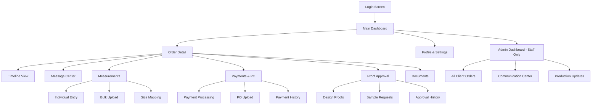

# Information Architecture (IA)

## Site Map / Screen Inventory

## Navigation Structure

**Primary Navigation:** Bottom tab bar for mobile with Dashboard, Orders, Messages, Profile. Desktop shows horizontal navigation with same sections plus Admin access for ColorGarb staff.

**Secondary Navigation:** Context-sensitive action buttons within each order detail view. Breadcrumb navigation for desktop users navigating deep into order sections.

**Breadcrumb Strategy:** Mobile relies on back button and contextual headers. Desktop shows full breadcrumb path: Dashboard > Order #12345 > Measurements for clear navigation hierarchy.
