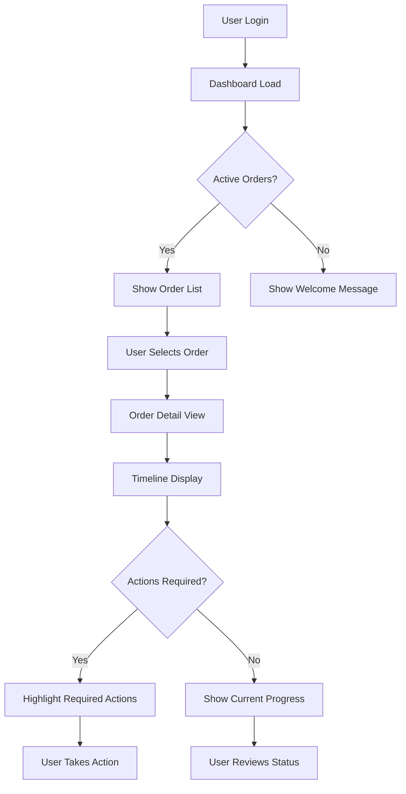
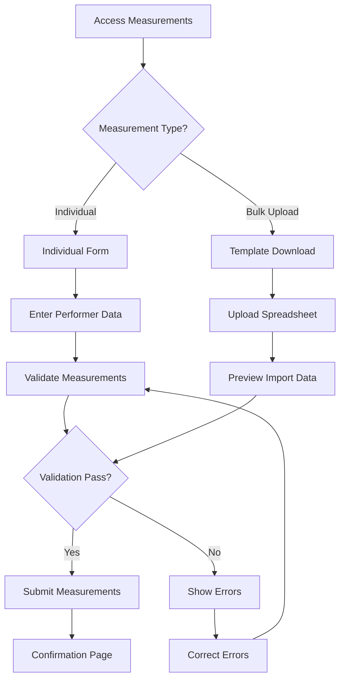
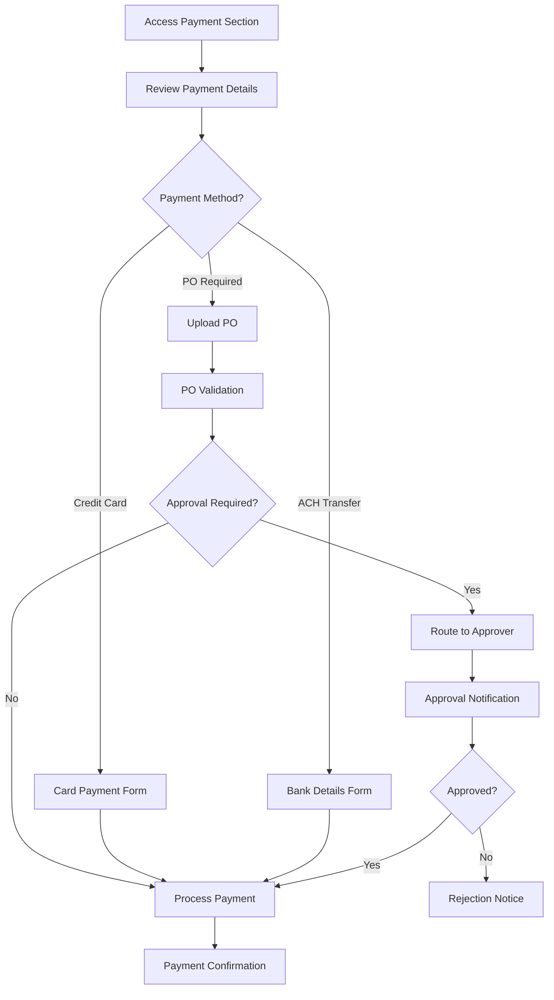

# User Flows

## Order Status Check Flow

**User Goal:** Quickly check the current status of active orders and understand next steps

**Entry Points:** Login screen, dashboard refresh, notification links

**Success Criteria:** User sees current stage, timeline progress, and any required actions within 30 seconds

### Flow Diagram

### Edge Cases & Error Handling:
- **Network timeout during dashboard load:** Show cached data with sync indicator
- **No active orders:** Display welcome message with contact information
- **Order data inconsistency:** Show last known status with refresh option
- **Required action deadline passed:** Highlight urgency and provide contact method

**Notes:** Flow optimized for mobile-first with minimal taps to reach critical information. Desktop version adds quick preview capabilities.

## Measurement Submission Flow

**User Goal:** Submit accurate measurements for all performers efficiently

**Entry Points:** Order detail page, notification link, dashboard measurement reminder

**Success Criteria:** All measurements validated and submitted with confirmation

### Flow Diagram

### Edge Cases & Error Handling:
- **Invalid measurement ranges:** Show acceptable ranges with measurement guide
- **Incomplete performer list:** Allow partial submission with missing performer tracking
- **File upload failure:** Provide manual entry fallback option
- **Size mapping conflicts:** Route to ColorGarb staff for custom size consultation

**Notes:** Dual-path design accommodates both small programs (individual entry) and large programs (bulk upload) with appropriate validation for each method.

## Payment Processing Flow

**User Goal:** Complete secure payment for costume order following organization's financial policies

**Entry Points:** Order detail payment section, invoice notification, payment reminder

**Success Criteria:** Payment processed successfully with proper documentation and approval trail

### Flow Diagram

### Edge Cases & Error Handling:
- **Payment processing failure:** Retry with alternative method options
- **PO number conflict:** Validation against existing PO database
- **Approval timeout:** Escalation to backup approver
- **Insufficient funds:** Clear error message with alternative payment options

**Notes:** Flow accommodates complex organizational approval workflows common in educational institutions while maintaining payment security standards.
