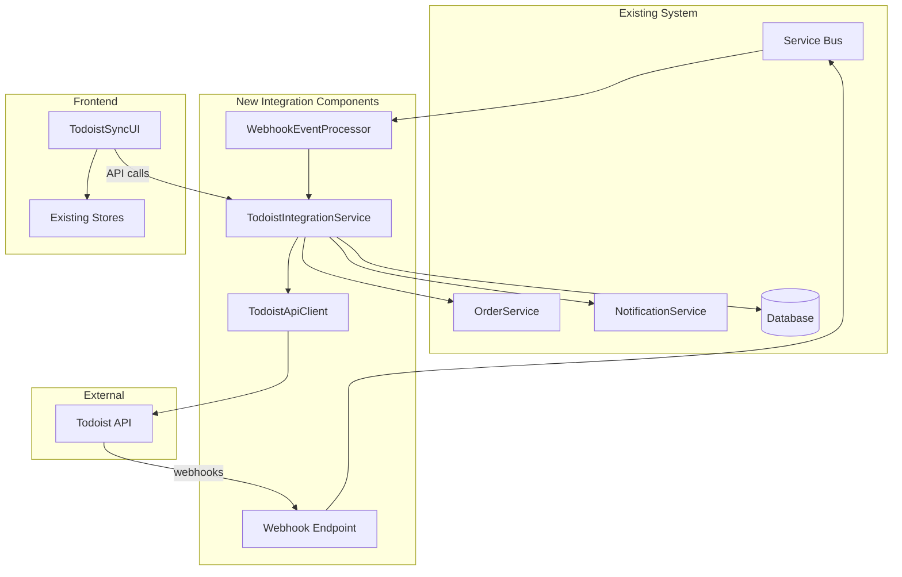

# ColorGarbApp Todoist Integration Brownfield Enhancement Architecture

## Introduction

This document outlines the architectural approach for enhancing ColorGarbApp with Todoist webhook integration. Its primary goal is to serve as the guiding architectural blueprint for AI-driven development of the integration while ensuring seamless integration with the existing system.

**Relationship to Existing Architecture:**
This document supplements existing project architecture by defining how new components will integrate with current systems. Where conflicts arise between new and existing patterns, this document provides guidance on maintaining consistency while implementing enhancements.

### Existing Project Analysis

**Current Project State:**
- **Primary Purpose:** Client portal for costume industry order management with communication workflows
- **Current Tech Stack:** React/TypeScript frontend, .NET Core Web API backend, Azure SQL Database
- **Architecture Style:** JAMStack with microservices-ready monolithic structure  
- **Deployment Method:** Azure Static Web Apps (frontend), Azure App Service (backend)

**Available Documentation:**
- Comprehensive fullstack architecture document (31k+ tokens)
- Complete PRD with detailed requirements
- Frontend specifications and UI generation prompts
- Testing strategy and deployment documentation

**Identified Constraints:**
- Must maintain Azure ecosystem consistency
- Existing Service Bus infrastructure for notifications
- .NET Core backend with Entity Framework patterns
- React/TypeScript frontend with Material-UI components

### Change Log

| Change | Date | Version | Description | Author |
|--------|------|---------|-------------|---------|
| Initial Architecture | 2025-01-15 | v1.0 | Comprehensive brownfield integration design | Winston (Architect) |

## Enhancement Scope and Integration Strategy

### Enhancement Overview
- **Enhancement Type:** External API Integration with Real-time Synchronization
- **Scope:** Bidirectional webhook-based integration between Todoist and ColorGarbApp order management
- **Integration Impact:** Medium - New microservice + database extensions, minimal changes to existing services

### Integration Approach
**Code Integration Strategy:** New dedicated microservice (`TodoistIntegrationService`) deployed alongside existing backend, communicating via existing Service Bus infrastructure and shared database

**Database Integration:** Extend existing schema with new tables (`TodoistProjects`, `SyncLog`, `WebhookEvents`) using Entity Framework migrations, maintaining existing order management schema integrity

**API Integration:** 
- New REST endpoints (`/api/v1/todoist/*`) following existing API patterns
- Leverage existing authentication/authorization middleware
- Webhook endpoint (`/api/v1/webhooks/todoist`) for real-time Todoist events

**UI Integration:** New React components integrated into existing order management views, following established Material-UI patterns and state management with Zustand

### Compatibility Requirements
- **Existing API Compatibility:** Full backward compatibility maintained - no changes to existing endpoints
- **Database Schema Compatibility:** Additive-only changes using EF migrations, existing queries unaffected
- **UI/UX Consistency:** New components follow existing design system, maintain current user workflows
- **Performance Impact:** <100ms additional latency for sync operations, existing order operations unchanged

## Tech Stack Alignment

### Existing Technology Stack

| Category | Current Technology | Version | Usage in Enhancement | Notes |
|----------|-------------------|---------|---------------------|--------|
| Frontend Framework | React | 18.0+ | New Todoist UI components | Follow existing component patterns |
| Frontend Language | TypeScript | 5.0+ | Type-safe integration logic | Extend existing type definitions |
| UI Components | Material-UI (MUI) | 5.0+ | Todoist status indicators | Consistent with existing design system |
| State Management | Zustand | 4.0+ | Todoist sync state management | Integrate with existing order stores |
| Backend Framework | .NET Core | 7.0+ | New TodoistIntegrationService | Deploy as separate microservice |
| Backend Language | C# | 11.0+ | Webhook processing & API calls | Leverage existing patterns |
| Database | Azure SQL Database | - | New sync tables | Extend existing schema |
| ORM | Entity Framework Core | - | Todoist entity management | Use existing DbContext patterns |
| Message Queue | Azure Service Bus | - | Sync event processing | Extend existing notification system |
| Cache | Redis | 7.0+ | Todoist API response caching | Use existing cache infrastructure |
| Authentication | Azure AD B2C | - | Todoist OAuth integration | Extend existing auth flows |
| Monitoring | Application Insights | - | Integration telemetry | Use existing logging patterns |
| Testing | Jest/xUnit | Latest | Integration test coverage | Follow existing test organization |

**New Technology Additions:** None required - full integration using existing technology stack

## Data Models and Schema Changes

### New Data Models

#### TodoistProject
**Purpose:** Maps ColorGarbApp orders to Todoist projects for bidirectional synchronization
**Integration:** One-to-one relationship with existing Order entity

**Key Attributes:**
- OrderId: int - Foreign key to existing Orders table
- TodoistProjectId: string - Todoist project identifier
- TodoistProjectName: string - Project name in Todoist
- SyncStatus: enum - Active, Paused, Failed, Disabled
- LastSyncedAt: DateTime - Timestamp of last successful sync
- CreatedAt: DateTime - Integration setup timestamp
- UpdatedAt: DateTime - Last modification timestamp

**Relationships:**
- **With Existing:** Order (one-to-one), Organization (many-to-one via Order)
- **With New:** WebhookEvents (one-to-many), SyncLogs (one-to-many)

#### WebhookEvent
**Purpose:** Stores incoming Todoist webhook events for processing and audit trail
**Integration:** Decouples webhook receipt from processing for reliability

**Key Attributes:**
- Id: Guid - Primary key
- TodoistProjectId: string - Source project identifier  
- EventType: string - task:completed, task:updated, project:updated
- EventData: string (JSON) - Full webhook payload
- ProcessingStatus: enum - Pending, Processing, Completed, Failed
- ProcessedAt: DateTime? - Processing completion timestamp
- ErrorMessage: string? - Error details if processing failed
- CreatedAt: DateTime - Event receipt timestamp

**Relationships:**
- **With Existing:** None (decoupled by design)
- **With New:** TodoistProject (many-to-one), SyncLogs (one-to-many)

#### SyncLog
**Purpose:** Comprehensive audit trail for all synchronization operations
**Integration:** Links to existing audit patterns for compliance

**Key Attributes:**
- Id: Guid - Primary key
- TodoistProjectId: string - Related project
- OrderId: int - Related order
- SyncDirection: enum - TodoistToApp, AppToTodoist
- SyncType: enum - StatusUpdate, DateChange, ProjectCreation
- SourceData: string (JSON) - Original data state
- TargetData: string (JSON) - Resulting data state
- Success: bool - Operation outcome
- ErrorDetails: string? - Error information
- SyncedAt: DateTime - Operation timestamp

**Relationships:**
- **With Existing:** Order (many-to-one)
- **With New:** TodoistProject (many-to-one), WebhookEvent (many-to-one)

### Schema Integration Strategy

**Database Changes Required:**
- **New Tables:** TodoistProjects, WebhookEvents, SyncLogs
- **Modified Tables:** None (additive-only approach)
- **New Indexes:** TodoistProjectId (clustered), OrderId (non-clustered), EventType + ProcessingStatus (composite)
- **Migration Strategy:** Entity Framework Code-First migrations with rollback capability

**Backward Compatibility:**
- All existing queries and operations remain unchanged
- New tables isolated from existing schema
- Foreign key constraints maintain referential integrity
- No breaking changes to existing API contracts

## Component Architecture

### New Components

#### TodoistIntegrationService
**Responsibility:** Core integration service handling bidirectional sync between Todoist and ColorGarbApp
**Integration Points:** Existing Service Bus for event publishing, shared database context, existing notification service

**Key Interfaces:**
- ITodoistSyncService - Synchronization operations
- IWebhookProcessor - Webhook event processing
- ITodoistApiClient - External API communication

**Dependencies:**
- **Existing Components:** OrderService, NotificationService, IServiceBus, ApplicationDbContext
- **New Components:** TodoistApiClient, WebhookEventProcessor

**Technology Stack:** .NET Core 7 hosted service, Entity Framework Core, HttpClient with Polly retry policies

#### TodoistApiClient
**Responsibility:** Manages all communication with Todoist REST API and handles authentication/rate limiting
**Integration Points:** Azure Key Vault for API credentials, Redis cache for response caching

**Key Interfaces:**
- CreateProject(order) - Creates Todoist project for new orders
- UpdateProject(projectId, changes) - Modifies project metadata
- GetProjectTasks(projectId) - Retrieves current task states
- RegisterWebhook(callbackUrl) - Sets up webhook endpoints

**Dependencies:**
- **Existing Components:** IKeyVaultService, IRedisCache, ILogger
- **New Components:** None

**Technology Stack:** HttpClient with Polly policies, JSON serialization, OAuth token management

#### WebhookEventProcessor
**Responsibility:** Processes queued webhook events and coordinates synchronization actions
**Integration Points:** Service Bus for event queuing, existing OrderService for status updates

**Key Interfaces:**
- ProcessWebhookEvent(eventId) - Processes individual events
- HandleTaskCompletion(taskData) - Updates order status
- HandleProjectUpdate(projectData) - Syncs project metadata

**Dependencies:**
- **Existing Components:** OrderService, NotificationService, IServiceBus
- **New Components:** TodoistIntegrationService

**Technology Stack:** .NET Core background service, Service Bus message handlers, Entity Framework

#### TodoistSyncUI (React Component)
**Responsibility:** Frontend interface for managing Todoist integration settings and viewing sync status
**Integration Points:** Existing API client patterns, Material-UI design system, Zustand state management

**Key Interfaces:**
- Connect/disconnect Todoist account
- View sync status and history
- Configure notification preferences
- Manual sync trigger

**Dependencies:**
- **Existing Components:** ApiClient, NotificationSystem, AuthService
- **New Components:** TodoistSyncStore (Zustand)

**Technology Stack:** React 18, TypeScript, Material-UI components, React Query for API state

### Component Interaction Diagram



## API Design and Integration

### API Integration Strategy
**API Integration Strategy:** Extend existing RESTful API with new `/api/v1/todoist/*` endpoints, maintaining consistency with current authentication patterns and error handling standards
**Authentication:** Leverage existing Azure AD B2C integration with additional OAuth flow for Todoist API credentials
**Versioning:** Follow existing v1 API versioning, future changes via v2 if breaking changes required

### New API Endpoints

#### POST /api/v1/todoist/connect
**Purpose:** Establishes Todoist integration for authenticated user's organization
**Integration:** Uses existing organization context and auth middleware

##### Request
```json
{
  "todoistApiToken": "string",
  "webhookUrl": "string",
  "syncPreferences": {
    "autoCreateProjects": true,
    "syncCompletedTasks": true,
    "notifyOnSync": true
  }
}
```

##### Response
```json
{
  "success": true,
  "integrationId": "guid",
  "webhookId": "string",
  "message": "Todoist integration established successfully"
}
```

#### GET /api/v1/todoist/sync-status/{orderId}
**Purpose:** Retrieves current synchronization status for specific order
**Integration:** Leverages existing order authorization checks

##### Request
Query parameters: orderId (int)

##### Response
```json
{
  "orderId": 12345,
  "todoistProjectId": "project_123",
  "syncStatus": "Active",
  "lastSyncedAt": "2025-01-15T10:30:00Z",
  "pendingChanges": false,
  "syncHistory": [
    {
      "timestamp": "2025-01-15T10:30:00Z",
      "type": "StatusUpdate",
      "success": true,
      "details": "Task completed: Final measurements"
    }
  ]
}
```

#### POST /api/v1/todoist/orders/{orderId}/sync
**Purpose:** Triggers manual synchronization for specific order
**Integration:** Integrates with existing order service and notification system

##### Request
```json
{
  "direction": "bidirectional",
  "forceSync": false
}
```

##### Response
```json
{
  "syncJobId": "guid",
  "status": "initiated",
  "estimatedCompletion": "2025-01-15T10:31:00Z"
}
```

#### POST /api/v1/webhooks/todoist
**Purpose:** Receives real-time webhook events from Todoist
**Integration:** Queues events via Service Bus for reliable processing

##### Request
```json
{
  "event_name": "item:completed",
  "event_data": {
    "project_id": "project_123",
    "item": {
      "id": "item_456",
      "content": "Final measurements approved",
      "checked": 1,
      "completed_at": "2025-01-15T10:30:00Z"
    }
  },
  "user_id": "user_789",
  "initiator": {
    "id": "user_789"
  }
}
```

##### Response
```json
{
  "received": true,
  "eventId": "guid",
  "status": "queued"
}
```

## External API Integration

### Todoist API
- **Purpose:** Real-time synchronization of project and task data between ColorGarbApp orders and Todoist projects
- **Documentation:** https://developer.todoist.com/rest/v2/
- **Base URL:** https://api.todoist.com/rest/v2/
- **Authentication:** Bearer token (OAuth 2.0)
- **Integration Method:** RESTful HTTP client with webhook subscriptions

**Key Endpoints Used:**
- `GET /projects` - Retrieve user's projects for mapping validation
- `POST /projects` - Create new project when order is created in ColorGarbApp
- `GET /projects/{id}/tasks` - Fetch current task completion status
- `POST /tasks` - Create order milestone tasks in Todoist
- `POST /sync` - Register webhook endpoints for real-time updates

**Error Handling:** 
- Rate limiting: 450 requests per 15 minutes (implement exponential backoff)
- Network failures: Polly retry policies with circuit breaker
- API errors: Queue failed operations for retry, maintain local sync status
- Authentication errors: Token refresh flow with secure credential storage

## Source Tree Integration

### Existing Project Structure
```plaintext
ColorGarbApp/
├── apps/
│   ├── web/                    # React frontend
│   │   ├── src/
│   │   │   ├── components/     # UI components
│   │   │   ├── services/       # API clients
│   │   │   ├── stores/         # Zustand state
│   │   │   └── pages/          # Route components
│   └── api/                    # .NET Core backend
│       ├── src/
│       │   ├── Controllers/    # API controllers
│       │   ├── Services/       # Business logic
│       │   ├── Models/         # Data models
│       │   └── Data/           # EF DbContext
├── docs/                       # Documentation
└── infrastructure/             # Deployment configs
```

### New File Organization
```plaintext
ColorGarbApp/
├── apps/
│   ├── web/
│   │   ├── src/
│   │   │   ├── components/
│   │   │   │   ├── orders/                    # Existing order components
│   │   │   │   └── todoist/                   # New Todoist UI components
│   │   │   │       ├── TodoistConnectDialog.tsx
│   │   │   │       ├── SyncStatusIndicator.tsx
│   │   │   │       ├── SyncHistoryTable.tsx
│   │   │   │       └── TodoistIntegrationSettings.tsx
│   │   │   ├── services/
│   │   │   │   ├── apiClient.ts               # Existing API client
│   │   │   │   └── todoistService.ts          # New Todoist API integration
│   │   │   ├── stores/
│   │   │   │   ├── orderStore.ts              # Existing order state
│   │   │   │   └── todoistStore.ts            # New Todoist sync state
│   │   │   └── types/
│   │   │       └── todoist.ts                 # New TypeScript interfaces
│   └── api/
│       ├── src/
│       │   ├── Controllers/
│       │   │   ├── OrdersController.cs        # Existing controller
│       │   │   ├── TodoistController.cs       # New integration endpoints
│       │   │   └── WebhooksController.cs      # New webhook handler
│       │   ├── Services/
│       │   │   ├── OrderService.cs            # Existing service
│       │   │   ├── TodoistIntegrationService.cs # New core integration
│       │   │   ├── TodoistApiClient.cs        # New API client
│       │   │   └── WebhookEventProcessor.cs   # New webhook processor
│       │   ├── Models/
│       │   │   ├── Entities/
│       │   │   │   ├── Order.cs               # Existing entity
│       │   │   │   ├── TodoistProject.cs      # New entity
│       │   │   │   ├── WebhookEvent.cs        # New entity
│       │   │   │   └── SyncLog.cs             # New entity
│       │   │   └── DTOs/
│       │   │       └── TodoistDTOs.cs         # New request/response models
│       │   └── Data/
│       │       ├── ApplicationDbContext.cs    # Modified: add new DbSets
│       │       └── Migrations/                # New EF migrations
│       │           └── AddTodoistIntegration.cs
```

### Integration Guidelines
- **File Naming:** Follow existing PascalCase for C# files, camelCase for TypeScript files
- **Folder Organization:** Group by feature (todoist/) within existing structure
- **Import/Export Patterns:** Use existing barrel exports and dependency injection patterns

## Infrastructure and Deployment Integration

### Existing Infrastructure
**Current Deployment:** Azure Static Web Apps (frontend), Azure App Service (backend), Azure SQL Database, Redis Cache, Service Bus
**Infrastructure Tools:** ARM templates, GitHub Actions CI/CD, Azure Application Insights monitoring
**Environments:** Development (localhost), Staging (staging.colorgarb.com), Production (portal.colorgarb.com)

### Enhancement Deployment Strategy
**Deployment Approach:** Deploy TodoistIntegrationService as part of existing backend App Service, no additional infrastructure required
**Infrastructure Changes:** 
- New webhook endpoint configuration in Application Gateway
- Additional Service Bus topic for Todoist events
- Key Vault secrets for Todoist API credentials
**Pipeline Integration:** Extend existing GitHub Actions workflow with Todoist integration tests and environment variable validation

### Rollback Strategy
**Rollback Method:** Database migration rollback + feature flag disable, maintain existing order functionality
**Risk Mitigation:** Feature flags for gradual rollout, comprehensive monitoring with Application Insights, automated health checks
**Monitoring:** New Application Insights custom metrics for sync success rates, webhook processing times, API error rates

## Coding Standards and Conventions

### Existing Standards Compliance
**Code Style:** Follow existing C# and TypeScript formatting rules, ESLint/Prettier for frontend, EditorConfig for backend
**Linting Rules:** Maintain existing ESLint configuration, add Todoist-specific rules for API client patterns
**Testing Patterns:** Unit tests with Jest/xUnit, integration tests with TestWebApplicationFactory, follow existing 80% coverage target
**Documentation Style:** XML documentation for C# public APIs, JSDoc for TypeScript interfaces, maintain existing README patterns

### Critical Integration Rules
- **Existing API Compatibility:** No modifications to existing endpoints, new Todoist endpoints follow established patterns
- **Database Integration:** Additive-only schema changes via EF migrations, maintain existing foreign key relationships
- **Error Handling:** Use existing global exception middleware, extend with Todoist-specific error types and logging
- **Logging Consistency:** Leverage existing Serilog configuration, add structured logging for sync operations with correlation IDs

## Testing Strategy

### Integration with Existing Tests
**Existing Test Framework:** Jest + React Testing Library (frontend), xUnit + Moq (backend), Playwright (E2E)
**Test Organization:** Follow existing folder structure with separate Unit/Integration/E2E test projects
**Coverage Requirements:** Maintain existing 80% code coverage, include new Todoist components in coverage reports

### New Testing Requirements

#### Unit Tests for New Components
**Framework:** xUnit for backend services, Jest for React components
**Location:** `apps/api/tests/Unit/TodoistTests/`, `apps/web/tests/components/todoist/`
**Coverage Target:** 80% minimum for all new components
**Integration with Existing:** Leverage existing TestWebApplicationFactory and mock services

#### Integration Tests
**Scope:** End-to-end webhook processing, API client error handling, database sync operations
**Existing System Verification:** Ensure order operations remain unaffected by integration
**New Feature Testing:** Webhook event processing, bidirectional sync validation, notification delivery

#### Regression Testing
**Existing Feature Verification:** Automated test suite covers existing order management workflows
**Automated Regression Suite:** Extend existing CI/CD pipeline with Todoist integration scenarios
**Manual Testing Requirements:** Order creation → Todoist sync → task completion → client notification flow

## Security Integration

### Existing Security Measures
**Authentication:** Azure AD B2C with JWT tokens, role-based authorization with organization isolation
**Authorization:** Claims-based authorization, row-level security in database queries
**Data Protection:** Encryption at rest (Azure SQL TDE), encryption in transit (HTTPS/TLS 1.2+), sensitive data in Key Vault
**Security Tools:** Application Insights security monitoring, Azure Security Center compliance scanning

### Enhancement Security Requirements
**New Security Measures:**
- OAuth 2.0 flow for Todoist API token acquisition with secure storage in Key Vault
- Webhook signature validation using HMAC-SHA256 to verify authentic Todoist requests
- Rate limiting for webhook endpoints (100 requests/minute) to prevent abuse
- Input validation for all Todoist API responses and webhook payloads

**Integration Points:**
- Extend existing JWT middleware to include Todoist integration permissions
- Use existing organization context for Todoist project access control
- Leverage current audit logging patterns for sync operation tracking

**Compliance Requirements:** Maintain existing FERPA compliance for educational data, ensure Todoist integration doesn't expose PII

### Security Testing
**Existing Security Tests:** Authentication flow tests, authorization boundary tests, input validation tests
**New Security Test Requirements:**
- Webhook signature validation testing
- OAuth token refresh flow testing  
- Cross-organization data isolation testing for Todoist projects
**Penetration Testing:** Include Todoist webhook endpoints in existing annual security assessment

## Next Steps

### Developer Handoff

**Implementation Guidance for ColorGarbApp Todoist Integration**

You're ready to implement the Todoist integration based on this comprehensive architecture analysis. Here are the key points for development:

**Reference Documents:**
- This brownfield architecture document validates integration approach with existing system
- Existing ColorGarbApp architecture (docs/architecture.md) - follow established patterns
- Project brief (docs/todoist-integration-brief.md) - business requirements and success criteria

**Integration Requirements Validated:**
- **Technology Stack:** 100% compatible with existing React/TypeScript + .NET Core + Azure infrastructure
- **Database Schema:** Additive-only changes via Entity Framework migrations maintain backward compatibility  
- **API Patterns:** New `/api/v1/todoist/*` endpoints follow existing RESTful conventions and authentication
- **Component Architecture:** Service Bus integration for reliable webhook processing aligns with current messaging patterns

**Key Technical Decisions Based on Project Analysis:**
- **Deployment Strategy:** Deploy as part of existing backend App Service (no new infrastructure)
- **Data Synchronization:** Leverage existing Service Bus for reliable event processing
- **Authentication Flow:** Extend current Azure AD B2C with OAuth for Todoist API credentials
- **UI Integration:** New React components follow established Material-UI patterns and Zustand state management

**Implementation Sequencing to Minimize Risk:**
1. **Phase 1:** Database schema + Entity Framework models (isolated from existing functionality)
2. **Phase 2:** Todoist API client + webhook processing (background service only)
3. **Phase 3:** Integration with existing OrderService (feature-flagged)
4. **Phase 4:** Frontend components + user-facing functionality
5. **Phase 5:** Production rollout with monitoring and rollback capability

**Critical Compatibility Requirements:**
- Zero impact on existing order management workflows
- All existing API endpoints remain unchanged
- Database queries maintain performance with proper indexing
- Service Bus topic separation prevents message processing conflicts

Ready to begin implementation with the **dev** agent, or would you like to refine any aspect of this architecture first?